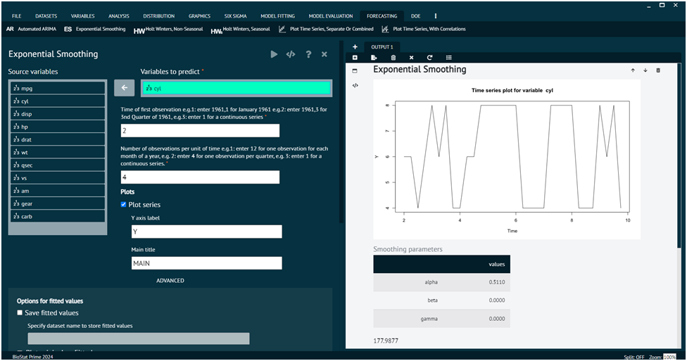

# Exponential Smoothing (ES)

Exponential smoothing is a time series forecasting method used in statistics. It is particularly useful for forecasting data points that exhibit a consistent pattern or trend over time. Exponential smoothing assigns exponentially decreasing weights to older observations in a time series, with more recent observations receiving higher weights. This approach is effective in capturing short-term fluctuations and trends in the data. The basic idea behind exponential smoothing is to assign weights to past observations, with the weights decreasing exponentially as the observations get older. The most commonly used exponential smoothing method is called Simple Exponential Smoothing (SES).

To analyse it in BioStat Prime user must follow the steps as given.

__Load the dataset -> Click on the Forecasting tab in main menu -> Select Exponential Smoothing (ES) -> Choose variables to predict -> Write Time of first observation -> Write Number of observations per unit of time -> Execute.__

{ width="700" }{ border-effect="rounded" }

The user can choose additional options like plot options.
