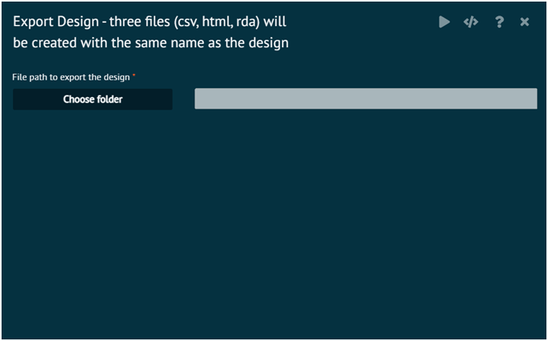

# Export Design Response

Exporting the Design will create three files __(csv, html, rda)__ with the same name as the design in the directory path chosen

>The purpose of exporting the design is to set up and conduct the experiments per the design in the real world and collect the results.
>
{style="note"}

Add column(s) that are compliant with R variable naming convention to the csv file to record the results. These additional columns are known as the response(s) per the vocabulary of Design of Experiments.

Once the response column(s) are added to the csv file, __DOE -> Import Design__ menu can be used to load the csv file against the correct design (already open) on the dataset UI grid.

{ width="700" }{ border-effect="rounded" }