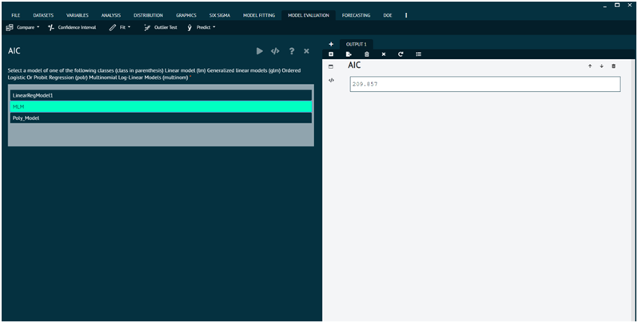
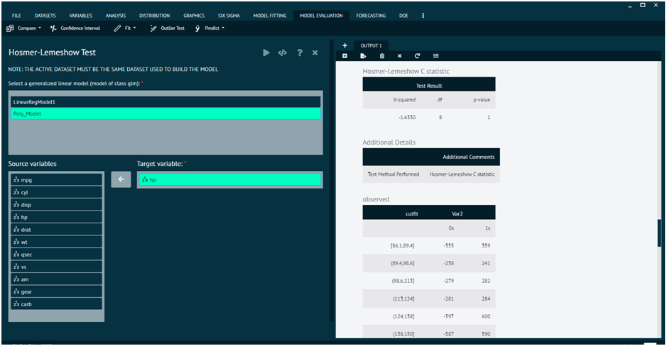
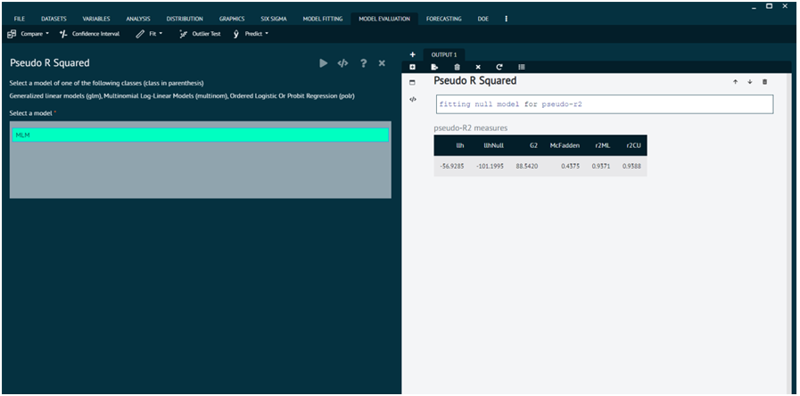

# FIT

When comparing models fitted by maximum likelihood to the same data, the smaller the AIC or BIC, the better the fit. The theory of AIC requires that the log-likelihood has been maximized: whereas AIC can be computed for models not fitted by maximum likelihood, their AIC values should not be compared.

Examples of models not ‘fitted to the same data’ are where the response is transformed (accelerated-life models are fitted to log-times) and where contingency tables have been used to summarize data.

These are generic functions (with S4 generics defined in package stats4): however methods should be defined for the log-likelihood function logLik rather than these functions: the action of their default methods is to call logLik on all the supplied objects and assemble the results. Note that in several common cases logLik does not return the value at the MLE: see its help page.

The log-likelihood and hence the AIC/BIC is only defined up to an additive constant. Different constants have conventionally been used for different purposes and so extractAIC and AIC may give different values (and do for models of class "lm": see the help for extractAIC). Particular care is needed when comparing fits of different classes (with, for example, a comparison of a Poisson and gamma GLM being meaningless since one has a discrete response, the other continuous).

BIC is defined as AIC(object, ..., k = log(nobs(object))). This needs the number of observations to be known: the default method looks first for a "nobs" attribute on the return value from the logLik method, then tries the nobs generic, and if neither succeed returns BIC as NA.

## AIC

Generic function calculating Akaike's ‘An Information Criterion’ for one or several fitted model objects for which a log-likelihood value can be obtained, according to the formula -2*log-likelihood + k*npar, where npar represents the number of parameters in the fitted model, and k = 2 for the usual AIC, or k = log(n) (n being the number of observations) for the so-called BIC or SBC (Schwarz's Bayesian criterion).

{ width="700" }{ border-effect="rounded" }

### Arguments

object
: a fitted model object for which there exists a logLik method to extract the corresponding log-likelihood, or an object inheriting from class logLik.

... optionally more fitted model objects.

k
: numeric, the penalty per parameter to be used; the default k = 2 is the classical AIC.

## BIC

### Arguments {id="arguments_1"}

object
: a fitted model object for which there exists a logLik method to extract the corresponding log-likelihood, or an object inheriting from class logLik.

... optionally more fitted model objects.

k
: numeric, the penalty per parameter to be used; the default k = 2 is the classical AIC.

{ width="700" }{ border-effect="rounded" }

## Hosmer-Lemeshow Test

The function computes Hosmer-Lemeshow goodness of fit tests for C and H statistic as well as the le Cessie-van Houwelingen-Copas-Hosmer unweighted sum of squares test for global goodness of fit.

Hosmer-Lemeshow goodness of fit tests are computed; see Lemeshow and Hosmer (1982). If X is specified, the le Cessie-van Houwelingen-Copas-Hosmer unweighted sum of squares test for global goodness of fit is additionally determined; see Hosmer et al. (1997). A more general version of this test is implemented in function residuals.lrm in package rms.

{ width="700" }{ border-effect="rounded" }

### Arguments {id="arguments_2"}

fit
: numeric vector with fitted probabilities.

obs
: numeric vector with observed values.

ngr
: number of groups for C and H statistic.

X
: covariate(s) for le Cessie-van Houwelingen-Copas-Hosmer global goodness of fit test.

verbose
: logical, print intermediate results.

## Pseudo R Squared

Numerous pseudo r-squared measures have been proposed for generalized linear models, involving a comparison of the log-likelihood for the fitted model against the log-likelihood of a null/restricted model with no predictors, normalized to run from zero to one as the fitted model provides a better fit to the data (providing a rough analogue to the computation of r-squared in a linear regression).

{ width="700" }{ border-effect="rounded" }

### Arguments {id="arguments_3"}

object
: a fitted model object, for now of class glm, polr, or mulitnom

... additional arguments to be passed to or from functions