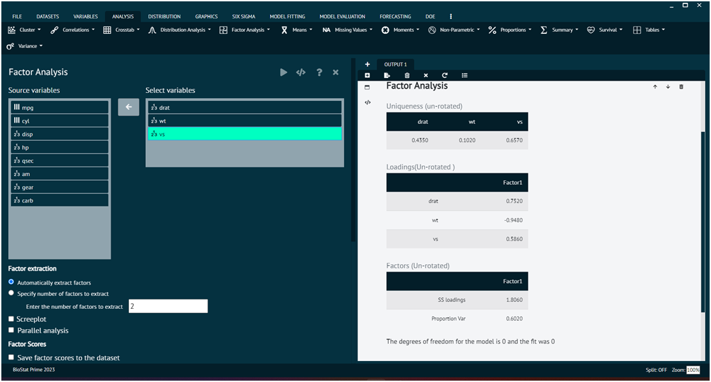
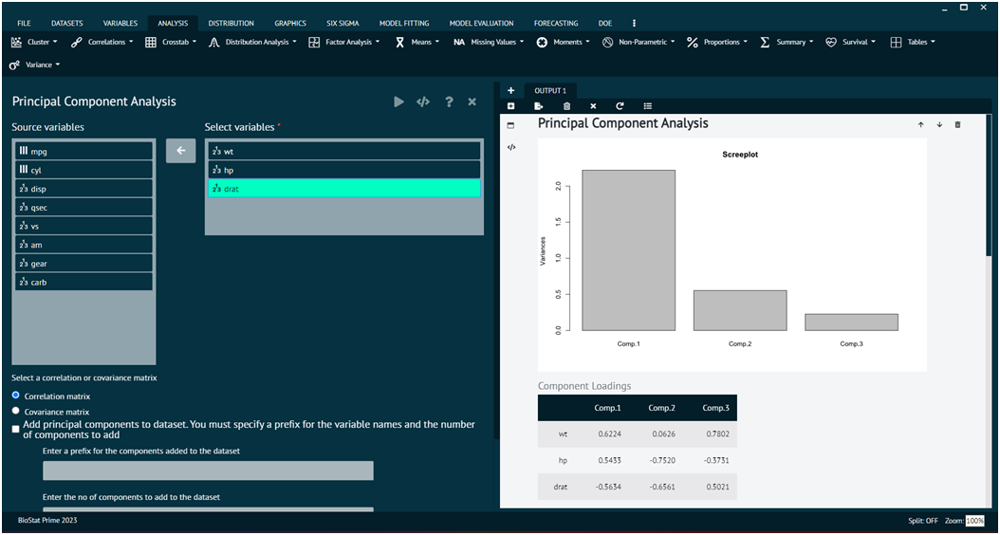

# Factor analysis

Factor analysis is a statistical technique used to identify and analyze underlying factors or latent variables that explain the observed correlations among a set of variables. The goal of factor analysis is to reduce the dimensionality of the data by identifying a smaller number of latent factors that explain the observed correlations among variables. This can simplify the interpretation of complex datasets and help identify underlying patterns or structures. Factor analysis can be conducted using various statistical software packages, and BioStat Prime utilized R packages to conduct factor analysis. BioStat Prime brings forth 2 ways of factor analysis, viz.
1. Factor
2. Principal Component Analysis.

Principal Component Analysis (PCA) and Factor Analysis (FA) are both techniques used in multivariate analysis to uncover patterns and relationships in high-dimensional data. However, they serve different purposes, and it's important to distinguish between them.

•	PCA can be viewed as a special case of factor analysis where all the variance in the data is treated as common (shared) variance.
•	Factor Analysis is more focused on capturing shared variance due to latent factors and specific (unique) variance associated with each variable.
•	In PCA, the principal components are linear combinations of the original variables and are not interpreted in terms of underlying constructs or factors.
While PCA and Factor Analysis share similarities, their primary objectives differ. PCA is primarily a variance-driven technique for dimensionality reduction, while Factor Analysis is a model-based technique for understanding the underlying structure of the data in terms of latent factors. The choice between them depends on the research question and the nature of the data.

### Factor Analysis

To analyse Factor Analysis in BioStat Prime user must follow the steps as given.

__Load the dataset -> Click on the analysis tab in main menu -> Select factor analysis tab -> Select Factor ->  Once the dialog appears choose the items to be included -> Specify no. of factors to be extracted, user can also save factors and take a scree plot -> Execute the dialog.__

For further information the user can explore model tuning and model evaluation options for the same.

{ width="700" }{ border-effect="rounded" }

### Principal Component Analysis

To analyse Principal Component Analysis in BioStat Prime user must follow the steps as given.

__Load the dataset -> Click on the analysis tab in main menu -> Select factor analysis tab -> Select Principal Component Analysis -> Once the dialog appears choose the items to be included specify no. of factors to be extracted, user can also save factors and take a scree plot -> Execute the dialog.__

For further information the user can explore model tuning and model evaluation options for the same.

{ width="700" }{ border-effect="rounded" }
