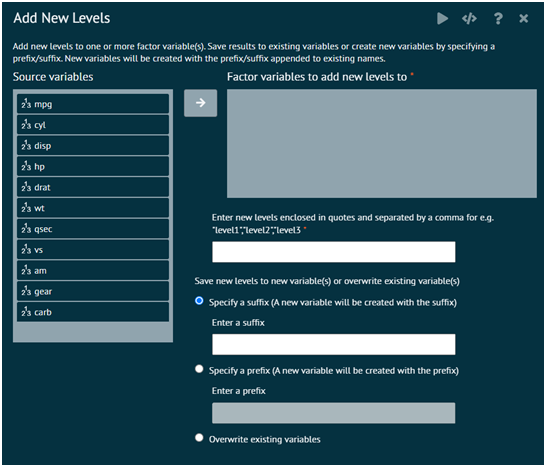
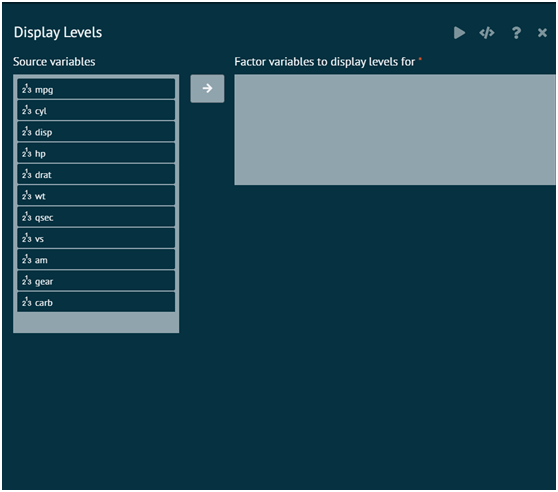
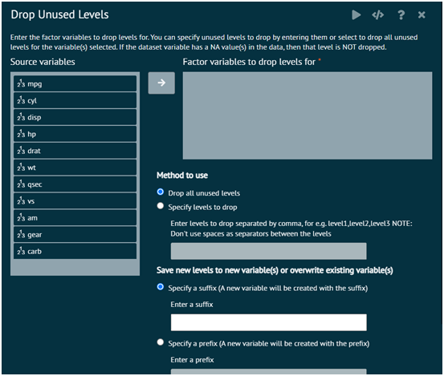
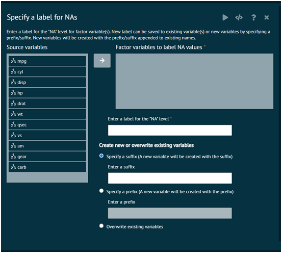
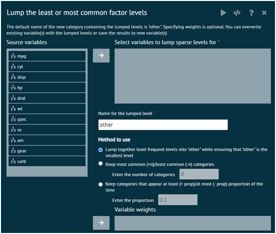
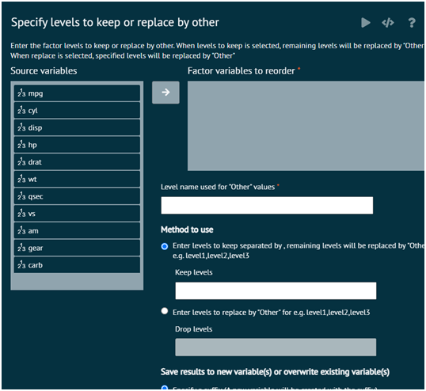
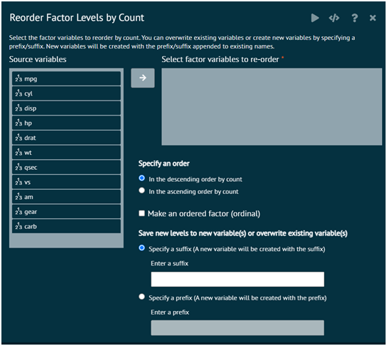
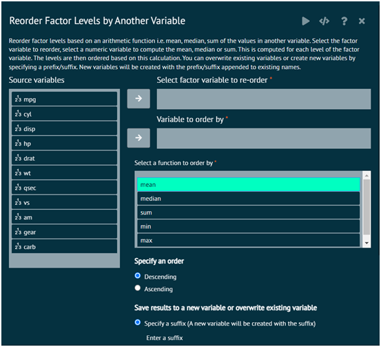
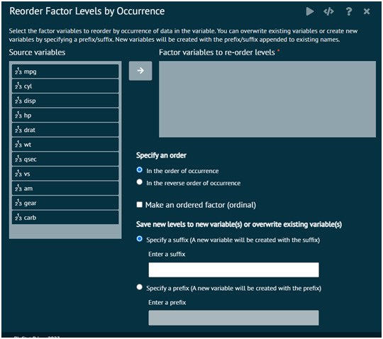
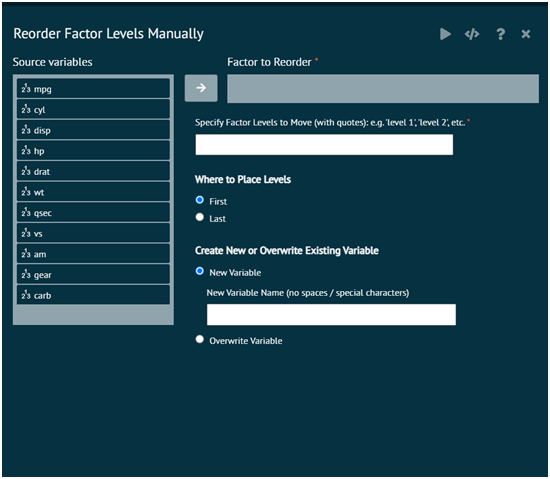

# Factor levels

### Add new levels
Adds additional levels to a factor. Add new levels to one or more factor variable(s). The results can be into existing variables (overwriting) or creating new variables by specifying a prefix/suffix. 

New variables will be created with the prefix/suffix appended to existing names.

{ width="700" }{ border-effect="rounded" }

>DON'T ENCLOSE LEVELS IN DOUBLE QUOTES OR SINGLE QUOTES. 
>
{style="note"}

> THERE CANNOT BE SPACES IN THE LEVEL NAMES. 
>
{style="note"}

> ENTER LEVELS SEPARATED BY COMMAS IN THE FORMAT LEVEL1,LEVEL2, LEVEL3
>
{style="note"}

### Display levels
Applies the levels function in base to the selected variables in the dataset. Users select the function in dplyr to pipe the variables to map the function that applies the levels function to each variable.

{ width="700" }{ border-effect="rounded" }

### Drop used levels
Enter the factor variable(s) to drop unused levels for. User can specify unused levels to drop by entering them or select to drop all unused levels for the variable(s) selected. If the dataset variable has a NA value(s) in the data, then that level is NOT dropped.

{ width="700" }{ border-effect="rounded" }

### Specify a label for NAs
Enter a label for the "NA" level for factor variable(s). New label can be saved to existing variable(s) (we overwrite existing variables) or new label for NA can be saved to new variables by specifying a prefix/suffix. New variables will be created with the prefix/suffix appended to existing names. This gives missing value an explicit factor level, ensuring that they appear in summaries and on plots.

{ width="700" }{ border-effect="rounded" }

### Lump the least or most common factor levels
Lump together the least or the most common factor levels into the "other" level. The default name of the new category containing the lumped levels is "other". Specifying weights is optional. User can overwrite existing variable(s) with the lumped levels or save the results to new variable(s)

{ width="700" }{ border-effect="rounded" }

### Specify levels to keep or replace by other
Enter the factor levels to keep or drop. When keep is selected, remaining levels will be replaced by "Other". When drop is selected, dropped levels will be replaced by "Other"

{ width="700" }{ border-effect="rounded" }

### Reorder Factor levels by Count
Re-order variables in the dataset in alphabetical order. BisStat Prime use the sort function to sort the names of the columns/variables in the dataset and the select function in the package dplyr to select the column names in the correct alphabetical order

{ width="700" }{ border-effect="rounded" }

### Reorder Factor levels by another variable
Reorder factor levels by sorting along another variable. Factor levels are reordered based on an arithmetic function i.e. mean, median, sum of the values in another variable. Select the factor variable to reorder, select a numeric variable to compute the mean, median or sum. This is computed for each level of the factor variable. The levels are then ordered based on this calculation. 

>The results can be saved into the existing variable(s) or user can create new variables by specifying a prefix/suffix. 
>
{style="note"}

>New variables will be created with the prefix/suffix appended to existing names.
>
{style="note"}

{ width="700" }{ border-effect="rounded" }

### Reorder by occurrence
Reorder factors levels by first appearance (occurence). See reorder by count for ordering by count/frequency.

{ width="700" }{ border-effect="rounded" }

### Reorder Manually
This is used to specify one or more factor levels that user wants to place first or last in the sort order. This can be useful for models, as the first factor level becomes the reference group for parameter estimates when using reference cell coding. They can also be useful in plotting as the sort order is used to display the categories.

{ width="700" }{ border-effect="rounded" }

The arguments used is executing the dialog are given as follows.

__Factor to Reorder__
: factor user wants to re-ordered

__Specify Factor Levels to Move (with quotes)__
: These are the factor levels user wants to reorder. Only existing levels will be reordered. If you specify a non-existent level, a warning will be output, but any existing levels will be ordered in the way user specified. View the levels in the Variables tab of the data grid to see the current levels and sort order or go to Variables > Factor Levels > Display. Note that specifying all existing factor levels will reorder all levels, regardless of whether user selects "First" or "Last" for level placement.

__Where to place levels__
: Selecting "First" will place the specified levels first in the sort order. Selecting "Last" will place the specified levels last in the sort order.

__Create new or overwrite existing variable__
: Controls whether user wants to create a new variable with a new name or overwrite the existing variable. The new variable name cannot contain special characters like #, $, %, &, (, ), =, etc. Underscores, "_", are allowed.

__Examples__
: Assume user has a four level factor with labels "a", "b", "c", "d" with a sort order of "a","b","c","d" (first to last). Specifying "d" as first in the sort order would create a factor with a sort order of "d", "a", "b", "c". Specifying "b", "a" as last in the sort order would create a factor with a sort order of "c","d","b","a". Specifying "b","c","d","a" (i.e. all levels) would create a factor with a sort order of "b","c","d","a".

>Required R Packages: dplyr, forcats
>
{style="note"}

