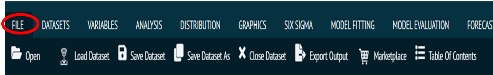
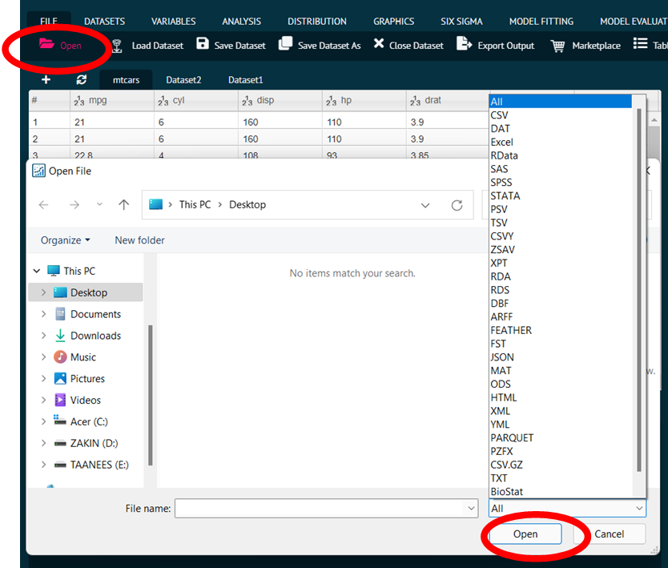
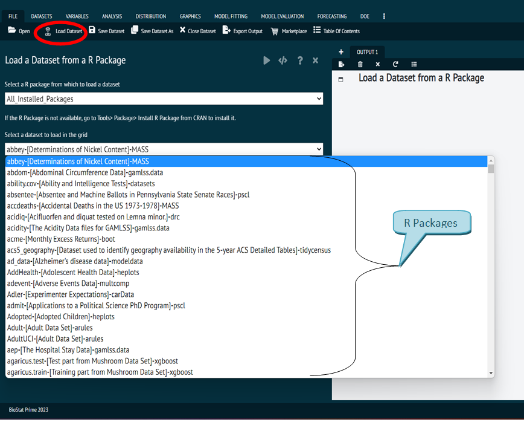
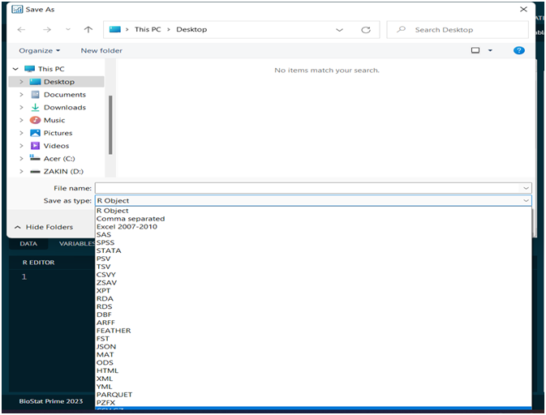
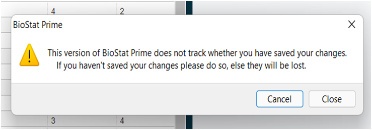
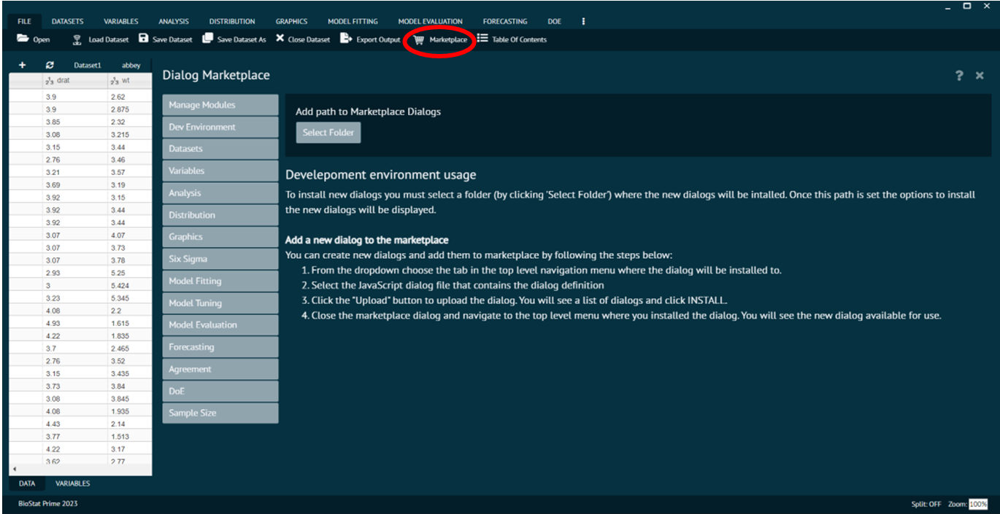
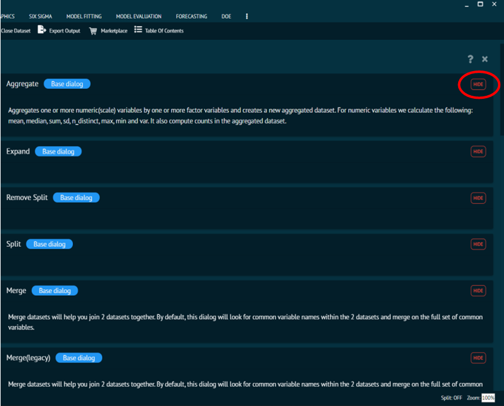

# File

The file function is the First function in the main menu. It leads the user to following sub functions.

{ width="700" }{ border-effect="rounded" }

## Open

Used to load external dataset from user’s PC/Laptop supporting various formats including;

Formats Supported
: `CVS`, `DAT`, `Excel`, `RData`, `SAS`, `SPSS`, `STSTA`, `PSV`, `TSV`, `CSVY`, `ZSAV`, `XPT`, `RDA`, `RDS`, `DBF`, `ARFF`, `FEATHER`, `FST`, `JSON`, `MAT`, `ODS`, `HTML`, `XML`, `YML`, `PARQUET`, `PZFX`, `CSV.GZ`, `TEXT`, `BioStat`.

{ width="700" }{ border-effect="rounded" }

## Load Dataset

Loads the datasets that are internal to BioStat Prime, along with it is the feature of installing the associated R packages. 

In order to load a dataset, user needs to do the following.

__Steps__
: __Select the dataset and R package from the dropdown in the load dataset dialog  ->  execute the dialog.__

If the user does not see a dataset in the dropdown, the package selected does not contain the dataset. 

>Thus, to install the R Package required by the user, user needs to go to __Tools -> Package -> Install R Package from CRAN.__

{ width="700" }{ border-effect="rounded" }

## Save Dataset

Saves the dataset the user had worked on into the following formats.

Formats Supported
: `R Object`, `Comma separated`, `Excel 2007-2010`, `SAS, SPSS`, `STATA`, `PSV`, `TSV`, `CSVY`, `ZSAV`, `XPT`, `RDA`, `RDS`, `DBF`, `ARFF`, `FEATHER`, `FST`, `JSON`, `MAT`, `ODS`, `HTML`, `XML`, `YML`, `PARQUET`, `PZFX`. 

The user can decide as per the requirement which format to choose. Save seeks to update the current content of the previously saved file,

## Save As

Save As aims to create a new folder or save an existing file to a new location with the same name or a different title. Formats used for save/save As the dataset are as follows;

Formats Supported
: `R Object`, `Comma separated`, `Excel 2007-2010`, `SAS`, `SPSS`, `STATA`, `PSV`, `TSV`, `CSVY`, `ZSAV`, `XPT`, `RDA`, `RDS`, `DBF`, `ARFF`, `FEATHER`, `FST`, `JSON`, `MAT`, `ODS`, `HTML`, `XML`, `YML`, `PARQUET`, `PZFX`.

{ width="700" }{ border-effect="rounded" }

## Close Dataset

Closes the dataset that user had been working on.
> BioStat issues a warning to save the dataset before closing it.
>
{style="warning"}

{ width="700" }{ border-effect="rounded" }

## Export output

Export output exports the output to be saved in user’s system. It is used to save the output of the analysis by exporting it to the PC/Laptop with file type as `R markdown`, as `HTML` or as `BioStat`.

{ width="700" }{ border-effect="rounded" }

## Marketplace

[Marketplace](Marketplace.md "The Marketplace is a free shop where R functions and libraries can be added to BioStat Prime to cover more recent statistical topics.") is one of the most popular feature of BioStat Prime as it enables the user to customise the application as per requirements and expands its functionality. 

Marketplace is a free store for adding R libraries and functions to  BioStat Prime to newer areas of statistics. 

It Installs or hides R functions and packages. User can install various new libraries and dialogs like [`Six Sigma`](Six-Sigma.md), `Agreement`, [`Model Fitting`](Model-Fitting.md), `Sample Size` and the associated libraries with them.

{ width="700" }{ border-effect="rounded" }

> The installation of various libraries increases the functionality of BioStat Prime, without any charges.
>
{style="note"}

{ width="700" }{ border-effect="rounded" }

> Also, the libraries of already installed [dialogs](How-to-use-BioStat-Prime.md#dialog "The Dialog is the window where different variables are selected to perform some tests or analysis."), can be hid by the user by clicking the hide button on right of the respective library.
>
{style="note"}

{ width="700" }{ border-effect="rounded" }