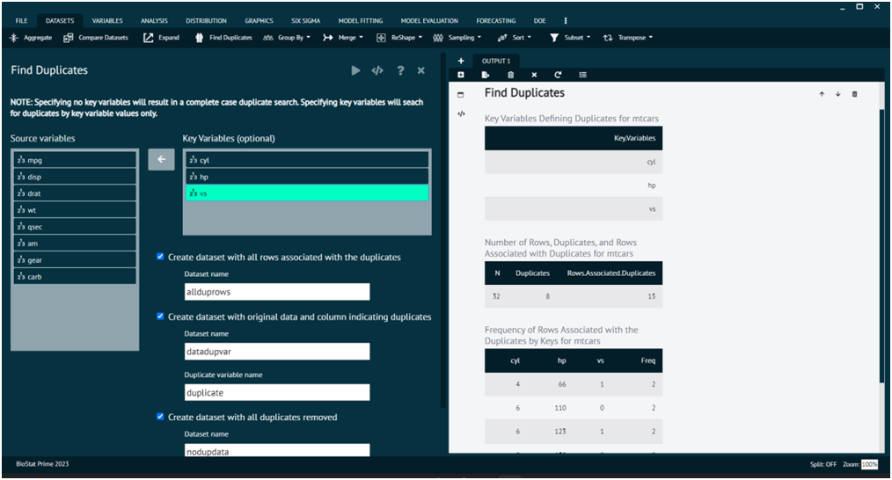
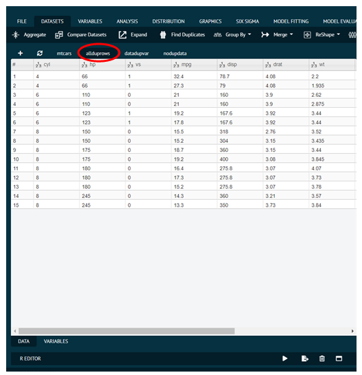
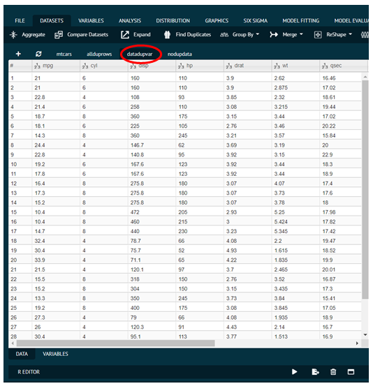
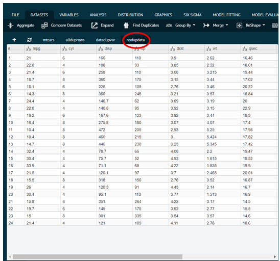

# Find Duplicates

This dialog will find duplicates either by `complete cases` or by `key variables`. 

Complete case duplicates are equal for every value for every variable. 

Duplicates using key variables are duplicates defined only by equal values for specific variables, called "keys". 

So, a duplicate row means the values are equal to a previous row.

>Duplicates are searched from the top to the bottom of the data set.
> 
{style="note"}

{ width="700" }{ border-effect="rounded" }

After finding the duplicates user can make 3 datasets, viz.

1)	Dataset with all rows associated with the duplicates.

{ width="700" }{ border-effect="rounded" }

2)	Dataset with original data and column indicating duplicates.

{ width="700" }{ border-effect="rounded" }

3)	Dataset with all duplicates removed.

{ width="700" }{ border-effect="rounded" }

Summaries of the options in the Find Duplicates dialog is provided below.

### Key Variables:
Specify optional key variables that define the duplicates. 
>If no key variables are selected, complete case duplicates will be searched for.
>
{style="note"}

### Create dataset with all rows associated with the duplicates: 
This will create a dataset of all duplicate rows and the first instance of each row corresponding to each duplicate. The output dataset will be sorted by all the variables in the complete duplicate case and by the key variables in the key variable case. The key variables will also be moved to the beginning of the output data set. The Dataset name field can be used to name this output data set.

### Create dataset with original data and column indicating duplicates: 
This will create a dataset including all the original data plus an additional column indicating the duplicate rows (0=not duplicate, 1=duplicate). The Dataset name field can be used to name this output data set. The Duplicate variable name field can be used to name this additional column.

### Create dataset with all duplicates removed: 
This will create a dataset that removes all the duplicate rows (either complete case or by key variables) where the duplicates are searched from top to bottom in the data set. This means all 2nd, 3rd, etc. instances of the rows will be removed. The Dataset name field can be used to name this output data set.

>Required R Packages: dplyr, arsenal
> 
{style="note"}