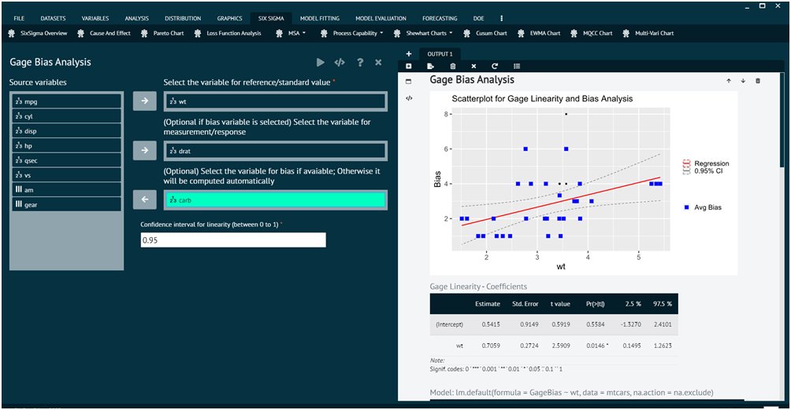

# Gage Bias Analysis

Gage Bias Analysis is a component of Measurement System Analysis (MSA) that focuses on evaluating and quantifying the bias or systematic error within a measurement system. The bias refers to the tendency of a measurement system to consistently overestimate or underestimate the true value of the characteristic being measured. Gage Bias Analysis helps identify and understand this systematic error to improve the accuracy of measurements.

To analyse in Gage Bias Analysis BioStat user must follow the steps given below.

Steps
: __Load the dataset -> Click on the Six Sigma tab in main menu -> Select MSA -> Choose Gage Bias Analysis -> This leads to analysis techniques in the dialog -> Selected the various options in the dialog according to the requirement -> Execute and visualise the output in output window.__

{ width="700" }{ border-effect="rounded" }
