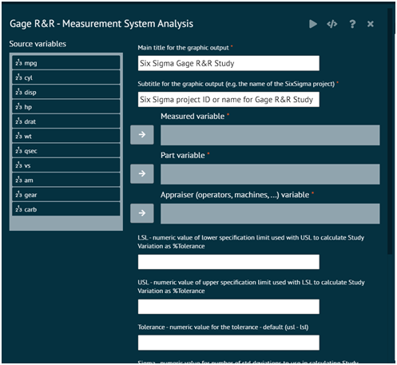

# Gage R&amp;R-Measurement System Analysis

This method assesses the variation in measurements due to operators (appraisers) and equipment (gages). It helps distinguish between variability introduced by the measurement system and the actual variation in the process.

To analyse in Gage R&R-Measurement System Analysis BioStat user must follow the steps given below.

__Load the dataset -> Click on the Six Sigma tab in main menu -> Select MSA -> Choose Gage R&R-Measurement System Analysis -> This leads to analysis techniques in the dialog -> selected the various options in the dialog according to the requirement -> Execute and visualise the output in output window.__

{ width="700" }{ border-effect="rounded" }
