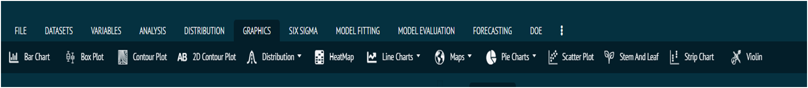

# Graphs and Charts

BioStat Prime provide users a variety of high-quality graphs and charts by utilizing the full potential of R language at the backend. R language is known for presenting the best data visualizing plots and BioStat Prime has taken advantage of that and put forth a section called Graphics in its main menu that not only has options for data visualization but also offers customization options for graph appearance, labels, and annotations. Some examples are.

`Bar Chart`, `Box Plot`, `Contour Plot`, `AB 2D Contour Plot`, `Distribution`, `HeatMap`, `Line Charts`, `Maps`, `Pie Charts`, `Scatter Plot`, `Stem and Leaf`, `Strip Chart`, `Violin`.

{ width="700" }{ border-effect="rounded" }
