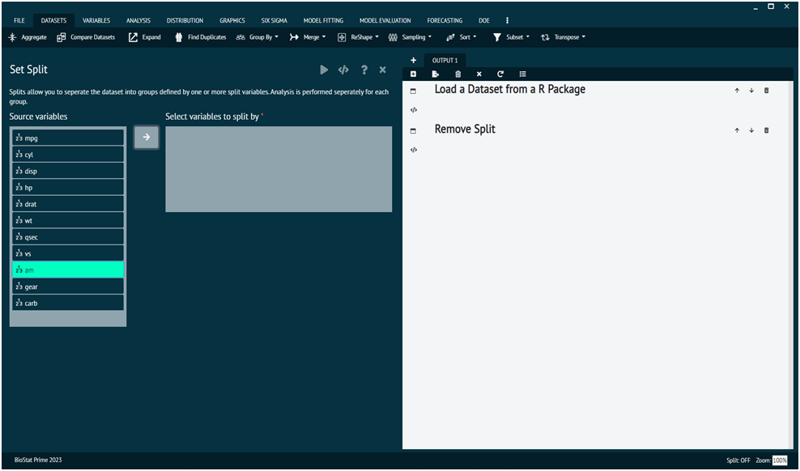

# Group By

This section of the dataset tab aids the user to split a loaded dataset and remove the split if a split is already set on dataset. It splits the data into groups based on the factors selected, once the dataset is split, the analysis user selects is performed independently for each split. 
>For example if user runs a crosstabulation analysis or a hypothesis test, this analysis is performed independently for each split (the output of the analysis is also generated separately for each split). 

This tab has two options, viz.

### Split

Splits allow you to separate the dataset into groups defined by one or more split variables. Analysis is performed separately for each group.

### Remove Split

Removes the split (if a split is set on the dataset).

{ width="700" }{ border-effect="rounded" }

The arguments used is executing the dialog are given as follows.

>Arguments
> 1. col.names: These are the column names/variable names that you want to split the dataset by, e.g. col.names =c("var1", "var2").
> 2. datasetnameorindex: this is the name of the index.​
> 3. removeall.splits: TRUE splits are removed, FALSE splits are added.

