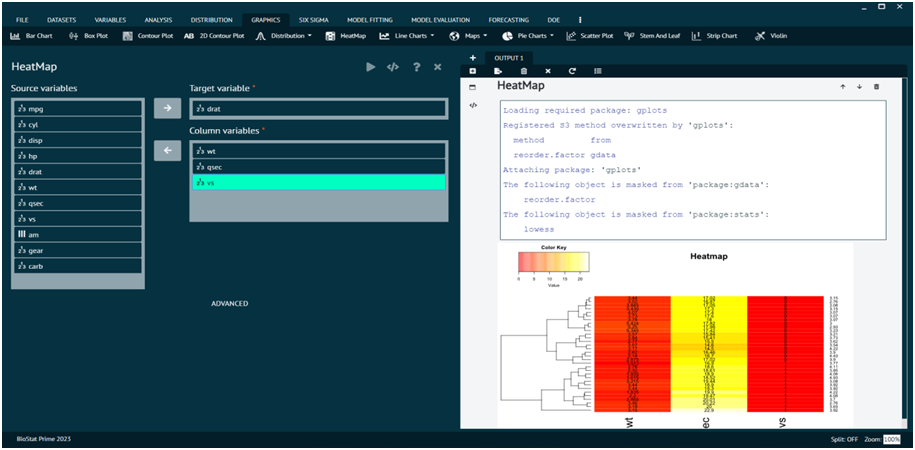
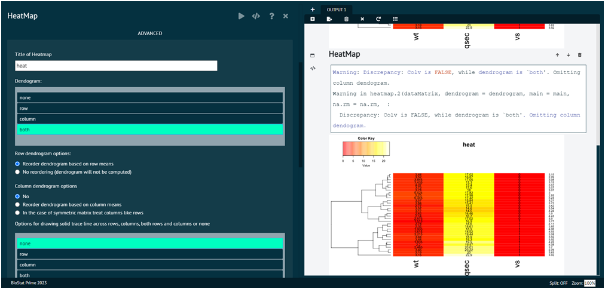

# HeatMap

For representing any dataset in terms of HeatMap

Steps
: __Load the dataset that needs to be visualized -> Go to Graphics -> HeatMap -> Put in the values for variables -> Execute the dialog.__

{ width="700" }{ border-effect="rounded" }

The advanced tab at the bottom leads to some advanced features of the as shown in the picture below.

{ width="700" }{ border-effect="rounded" }
