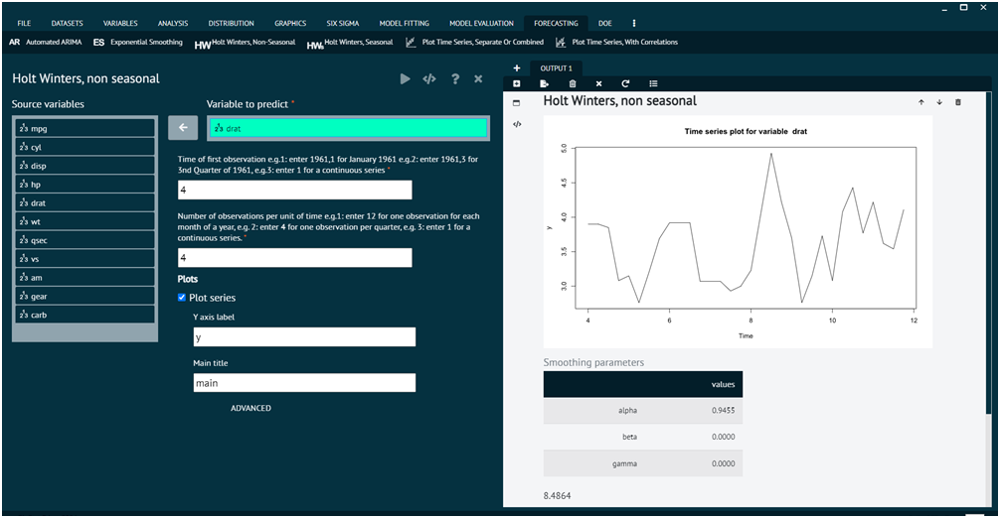

# Holt Winters, Non-seasonal

Holt-Winters Exponential Smoothing is an extension of simple exponential smoothing that takes into account both level and trend components in a time series, and optionally, seasonality. When seasonality is not present in the data, the method is referred to as Holt-Winters Exponential Smoothing without seasonality, or simply non-seasonal Holt-Winters.

To analyse it in BioStat Prime user must follow the steps as given.

__Load the dataset -> Click on the Forecasting tab in main menu -> Select Holt winters, non-seasonal -> Choose variables to predict -> Write Time of first observation -> Write Number of observations per unit of time -> Execute.__

{ width="700" }{ border-effect="rounded" }
