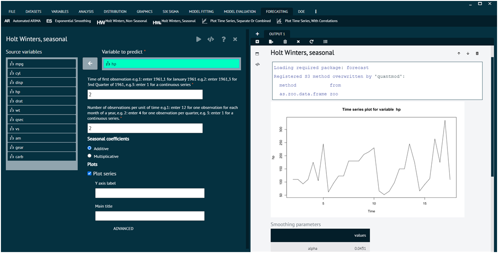

# Holt Winters, Seasonal

The method involves initializing the model parameters, updating them with each new observation, and then using the model to make forecasts. The choice between additive and multiplicative methods depends on the nature of the seasonality in the data. Holt-Winters is a statistical method used for time series forecasting. It's an extension of the exponential smoothing method and is particularly useful for forecasting data with seasonality.

To analyse it in BioStat Prime user must follow the steps as given.

__Load the dataset -> Click on the Forecasting tab in main menu -> Select Holt winters, seasonal -> Choose variables to predict -> Write Time of first observation -> Write Number of observations per unit of time -> Execute.__

{ width="700" }{ border-effect="rounded" }
