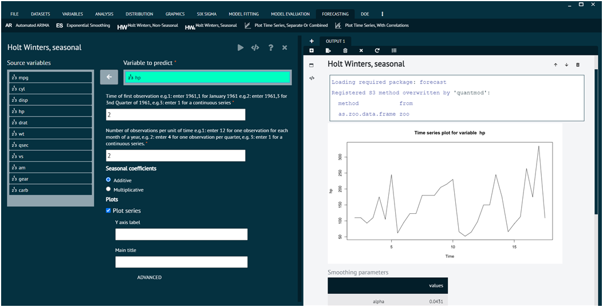

# Holt Winters, Seasonal

The method involves initializing the model parameters, updating them with each new observation, and then using the model to make forecasts. The choice between additive and multiplicative methods depends on the nature of the seasonality in the data. Holt-Winters is a statistical method used for time series forecasting. It's an extension of the exponential smoothing method and is particularly useful for forecasting data with seasonality.

To analyse it in BioStat Prime user must follow the steps as given.

Steps
: __Load the dataset -> Click on the Forecasting tab in main menu -> Select Holt winters, seasonal -> Choose variables to predict -> Write Time of first observation -> Write Number of observations per unit of time -> Execute.__

{ width="700" }{ border-effect="rounded" }

## Arguments

vars
: select a variable to build a model for

start
: Time of first observation should be entered in the format year,month or year,quarter e.g.( if your data is organized in months the 1992,1 for Jan 1992 or if your data is organized in quarters then 1992,1 refers to the first quarter of 1992.

frequency
: Number of observations in unit time. Example: for monthly there are 12 observation in a year. For quarterly there are 4 observation in a year.

exponential
: Determines whether exponential smoothing will be done, value set to FALSE

seasonal
: Character string to select an "additive" (the default) or "multiplicative" seasonal model. The first few characters are sufficient e.g. "add" or "mult".

plotSeries
: if TRUE a time series plot will also be generated.

saveFitted
: if TRUE fit values are saved.

plotOriginalandForecast
: Plot original and forecasted series

predict
: if TRUE predicted values will also be generated.

savePredictedVals
: predicted values will be saved.

plotPredictedValues
: predicted values will also be plotted.

correlogram
: if TRUE a correlogram will be generated.

main
: main title of the plot

ylab
: title for the y axis

dataset
: the name of the dataset from which the variables have been selected
