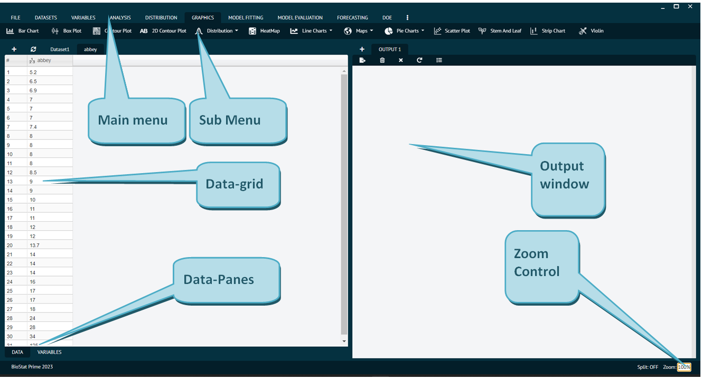
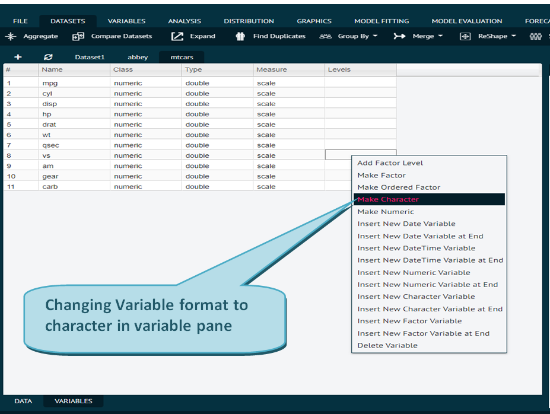
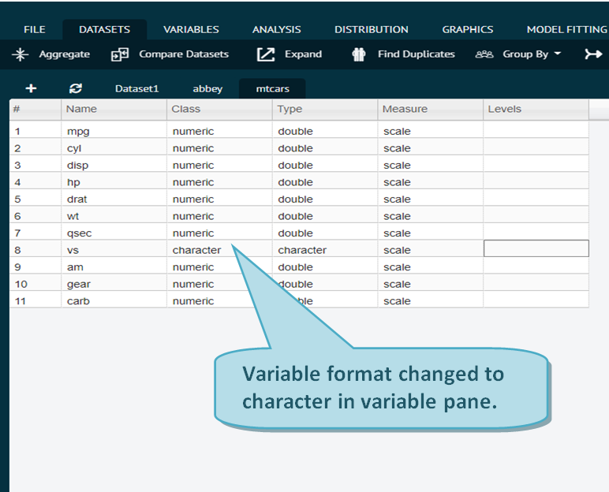
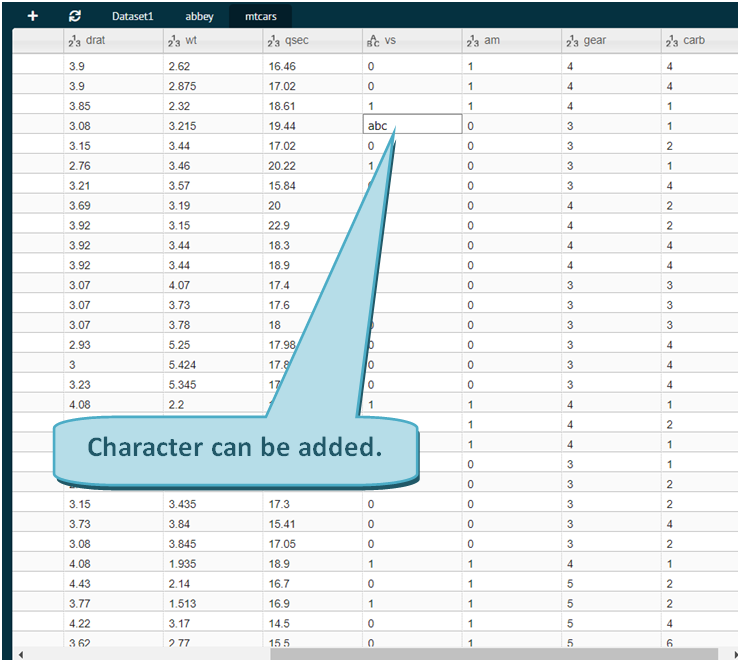
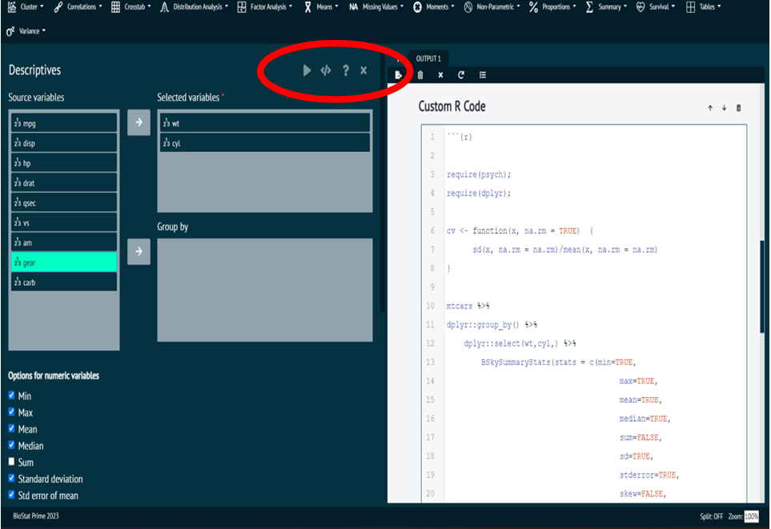
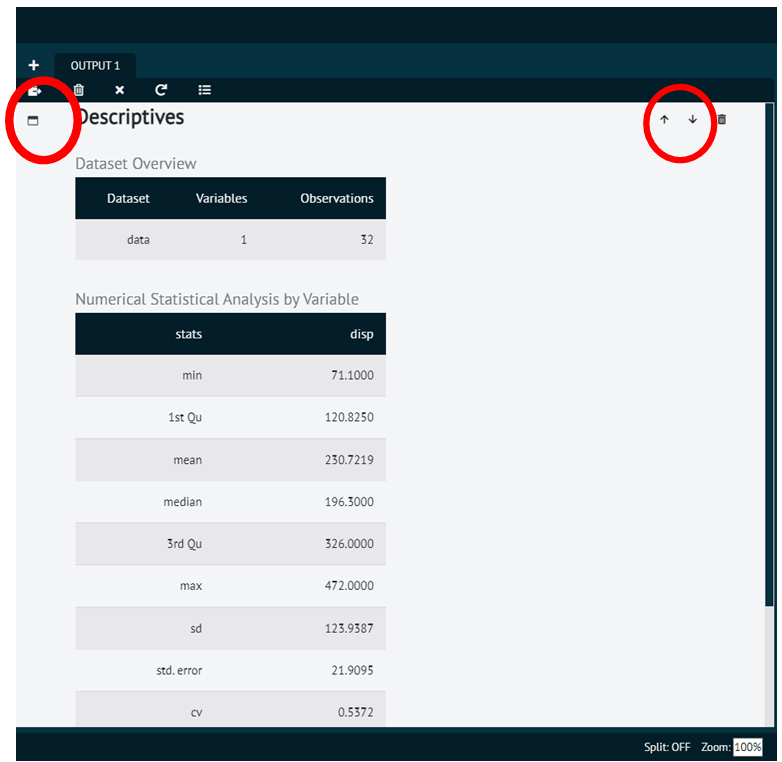
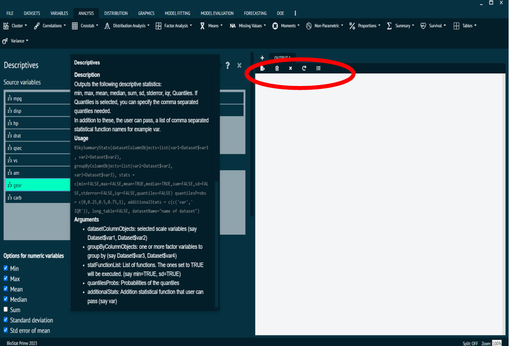

# How to use BioStat Prime

Here is a step-by-step tutor on how to use and explore the BioStat Prime software. Following this guide will ensure a smooth and effective use of the software.

## The UI of the software

As the software opens, user can see a blank unconstrained spreadsheet on left side and blank output on right side. __User has to fill this spreadsheet with some data and perform various tests__. 

To populate the spreadsheet user can either type manually or user can __copy past from Excel__ or __user can even load some inbuilt datasets__.

UI
: The User Interface (UI) of BioStat Prime is divided into following sections; Main menu, Sub menu, [Output window](#output-window "Output is displayed in the output window."), [Data-grid](#working-with-data-grid "A blank unconstrained spreadsheet") and [R console](Advanced-Users.md "The R console provides an opportunity for users to write, edit and execute the R code in console."), Zoom control.

{ width="700" }{ border-effect="rounded" }

All the datasets that are imported into the software are displayed in the data-grid. The data-grid has two panes: `data pane` and `variable pane`. 

> Both the panes are fully interactive.

>The main menu, at the top, comprises different functions that are responsible for data manipulation commands. 

>Inside the main menu, is a sub menu that has various functions and tests that can be performed on the data and for all the functions in sub menu, if the user presses dropdown button, then related sub functions will appear in the drop-down. 

>The result of analysis is displayed in output window. 

> In BioStat Prime the user can work on multiple data pane windows.
>
{style="note"}

## Working with Data-grid

As the user starts to enter data inside the data-grid, he needs to make sure to specify which is which variable. Data-grid can contain variables of different types e.g. `numeric`, `integer`, `logical`, `ordered factor`, etc. 

By making changes in variable pane user can have different levels of data grid columns. To make any change in the variable formatting the user need to switch to variable pane and the select the variable row to be changed with a right click. 

In data pane user has access to various data types and in variable pane user has access to various variable types, imported from the dataset. All the research will be displayed in the output window.

> Whenever user enters some data the output shows a comment stating Grid Edit.

{ width="700" }{ border-effect="rounded" }

This will open a pop-up window as shown above.

{ width="700" }{ border-effect="rounded" }

> User can change the formats of any column in variable section and that will be reflected in data-pane.
>
{style="note"}

{ width="700" }{ border-effect="rounded" }

## Dialog

On selecting any of the statistical function, a window will appear replacing the data-grid. This window is called `Dialog`. 

The Dialog is where different variables are selected to perform some tests or analysis. 

>The variable from source side is sent to the target side by selecting it and clicking the arrow button. 

>To select multiple variables, user needs to hold Alt button on keyboard and select multiple source variables.
>
{style="note"}

For each statistical function there are function specific options at the top of dialog window.

The top right corner of the dialog contains a few options like;

Execute button 
: Executes the dialog.

Syntax button
: Displays the R syntax for respective dialog analysis.

? 
: Provides quick summary help.

Cross button
: Used for closing dialog so that user can visualize the dataset.

{ width="700" }{ border-effect="rounded" }

## Executing the Dialog

Once the input for analysis is fed into the dialog, the execution is performed by __execute dialog button__ `|>` and the output is displayed in the output window. 

>The box in the left column brings up the dialog again.  It is like the history that tells us about the criteria we had chosen. 

>But that is valid for the initial values only, once the dialog is executed then history will bring up only the initials values and not the values inserted later. 
> 
{style="note"}

>Also, as soon as user edits the R syntax associated with the dialog, user removes the association between dialog and the output window because of which the history is no more saved in the dialog and the output is executed as per the R syntax. 
>
{style="note"}

>The arrow buttons in top right corner of output window aids the user in navigating between the different outputs by moving up and down.

{ width="700" }{ border-effect="rounded" }

## Output Window

For each output of statistical analysis there are function specific options at the top of output window. From left to right.

{ width="700" }{ border-effect="rounded" }

{type="full"}
Export
: Used to save the output of the analysis by exporting it to the PC/Laptop with file type as R markdown, as HTML or as BioStat.

{type="full"}
Delete
: Used to clear the output of the analysis.

{type="full"}
Close
: Closes the output window (but atleast one output window should always be open).

{type="full"}
Refresh
: Used to restart the R console.

> NOTE:

> 1.	User can visualize dialog window and data-grid at the same time, for that the user needs to click, hold and drag the dialog window to a different position.
>
{style="note"}

> 2. In order send the variables to target or destination box in dialog, the user needs to select the required variable and click the arrow button to send or un-send the source variable to target.
>
{style="note"}