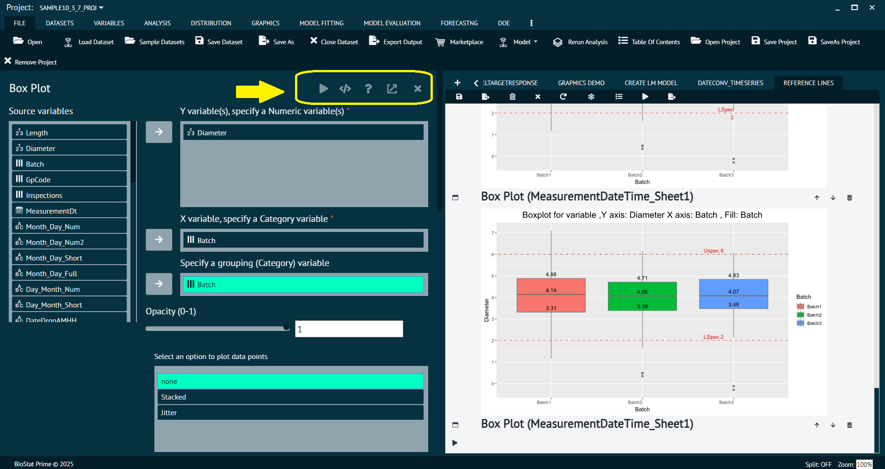
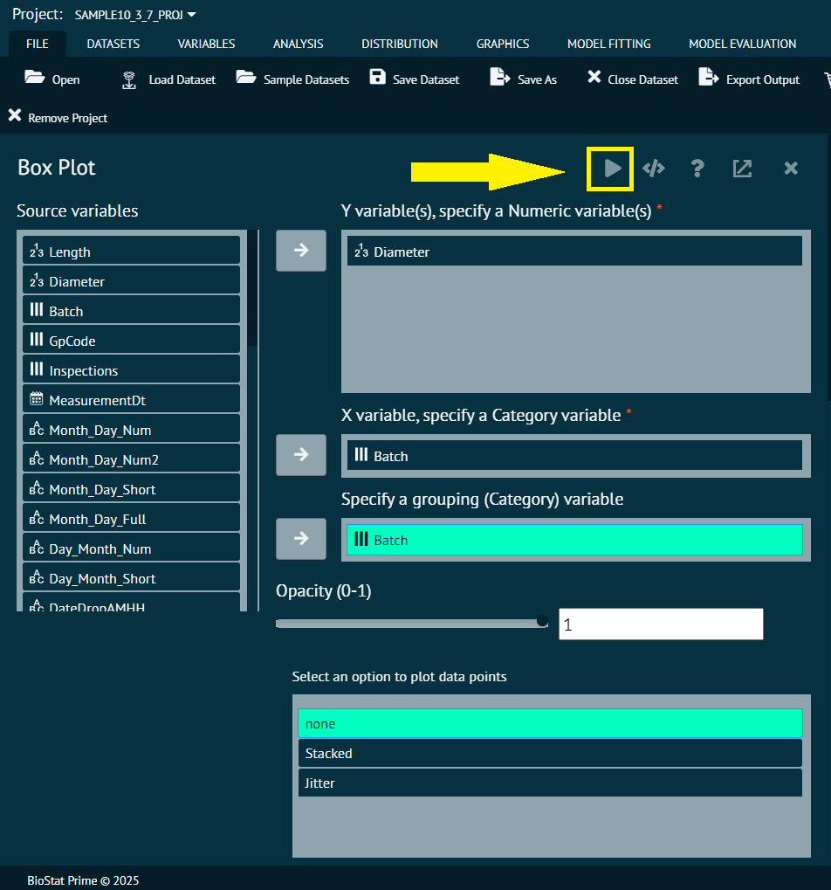
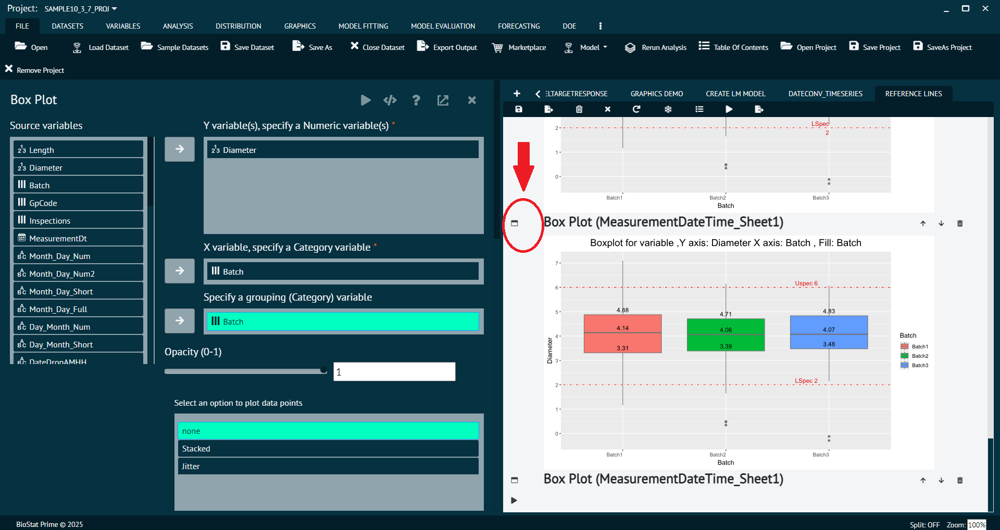

# Using BioStat Prime

Welcome to the BioStat Prime user guide. This step-by-step guide will help you explore and utilize the features of BioStat Prime efficiently. The guide is designed to ensure a smooth and productive user experience.

## User Interface Overview

Upon launching BioStat Prime, the user interface (UI) is divided into the following key sections:

Main Menu
: Located at the top, it provides access to essential functions related to data manipulation, analysis, and project operations.

Sub Menu
: Nested within the main menu, the sub menu displays various statistical tests and tools. Clicking the dropdown arrow beside a function reveals all related sub-functions.

Data Grid
: Displayed on the left side, this section hosts all imported or manually entered datasets. The data grid consists of:
1. __Data Pane__ – Contains the dataset with editable cells.
2. __Variable Pane__ – Displays variable-specific metadata such as name, type, and format. Both panes are fully interactive.

Output Window
: Located on the right side, this is where the results of all statistical analyses and visualizations are displayed.

R Console
: Embedded for users who prefer custom scripting and direct interaction with the R environment.

Zoom Control
: Adjusts the view size of the data grid and output for better visibility.

>BioStat Prime allows users to work with multiple data panes simultaneously for comparative or independent analysis.

{ width="700" }{ border-effect="rounded" }

## Working with Data in BioStat Prime

### Entering Data

Users can populate the Data Grid using several methods:

1. __Manual Entry__ – Click on any cell and enter values directly.

2. __Copy__-Paste from Excel or Other Applications

Copy data using Ctrl + C

Paste directly into the data grid using Ctrl + V

3. __Load Inbuilt Datasets__ – Select from sample datasets for demonstration or practice.

4. __File Import__ – Load files in formats such as .csv, .xlsx, .txt, etc.

All imported datasets appear in the data grid, ready for manipulation and analysis.

> Whenever user enters some data the output shows a comment stating Grid Edit.

### Working with the Data Grid

The Data Pane displays dataset values, while the Variable Pane allows for formatting variables.

Data grid supports multiple data types: `numeric`, `integer`, `logical`, `factor`, `ordered factor`, etc.

__To format a variable:__

1. Switch to the variable pane.

2. Right-click on the variable row to modify its properties (e.g., type, levels).

3. Upon editing the grid, a system message is shown in the output: “Grid Edit”.

{ width="700" }{ border-effect="rounded" }

This will open a pop-up window as shown above.

{ width="700" }{ border-effect="rounded" }

> User can change the formats of any column in variable section and that will be reflected in data-pane.
>
{style="note"}

{ width="700" }{ border-effect="rounded" }

### Undo and Redo Data Edits

BioStat Prime provides undo/redo functionality:

1. __Undo__ – Reverts recent changes in single or multiple cells.

2. __Redo__ – Restores the undone changes.

These features help maintain data integrity during manual edits.

### Saving and Opening Projects

All work in BioStat Prime, including datasets and analysis outputs, can be saved as a Project.

1. __Save Project__ – Preserve your complete work session into a .bsp (BioStat Prime Project) file. 

This includes:

All imported or entered datasets.

All statistical tests and analysis results.

2. __Open Project__ – Load a previously saved project to continue analysis or review prior results.

3. __Project Sharing & Collaboration__ – .bsp files are portable and can be shared with other BioStat Prime users for collaborative work or for validation and auditing purposes.

4. __Reproducibility__ Projects offer a transparent and complete snapshot of your workflow, supporting reproducible research and analysis.

## Dialog Window

When a statistical function is selected, a Dialog window overlays the data grid temporarily:

### Source & Target Selection

Variables are moved from the source to target box using the arrow button.

To select multiple variables: hold the Alt key and select desired variables.

### Function-Specific Options

Located at the top of the dialog to customize the analysis.

### Dialog Toolbar (Top-Right Corner)

Execute 
: Runs the analysis.

Syntax 
: Displays the underlying R code.

Help (?) 
: Offers a quick summary.

Function-Specific Help
: Provides direct access to detailed guidance related to the selected function within the help documentation.

Close (X) 
: Closes the dialog and returns to the data grid.

> You can visualize both the dialog and the data grid at the same time by dragging the dialog window to a new position.
>
{style="note"}

{ width="700" }{ border-effect="rounded" }

## Executing the Dialog

Once variables and options are selected:

1. Click the Execute button to perform the analysis.

{ width="700" }{ border-effect="rounded" }

2. The results are displayed in the Output Window.

3. The box in the left column of the output window allows re-opening of the dialog with initial settings (not the modified ones).

{ width="700" }{ border-effect="rounded" }

>If the R syntax is manually edited after executing a dialog, the association between dialog and output is broken. In this case, only the modified syntax is retained, and dialog history is no longer preserved.
>
{style="note"}

## Output Window

For each output of statistical analysis there are function specific options at the top of output window. From left to right.

{ width="700" }{ border-effect="rounded" }

{type="full"}
Export
: Used to save the output of the analysis by exporting it to the PC/Laptop with file type as R markdown, as HTML or as BioStat.

{type="full"}
Delete
: Used to clear the output of the analysis.

{type="full"}
Close
: Closes the output window (but atleast one output window should always be open).

{type="full"}
Refresh
: Used to restart the R console.

> NOTE:

> 1.	User can visualize dialog window and data-grid at the same time, for that the user needs to click, hold and drag the dialog window to a different position.
>
{style="note"}

> 2. In order send the variables to target or destination box in dialog, the user needs to select the required variable and click the arrow button to send or un-send the source variable to target.
>
{style="note"}