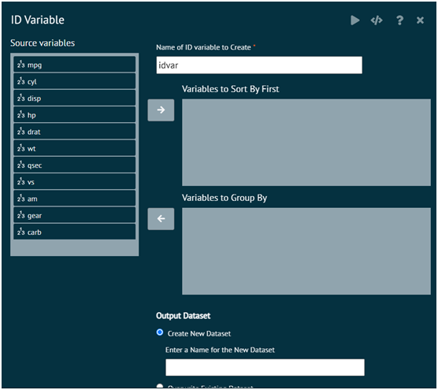

# ID Variable
Creates a numeric row identification (ID) variable in either the current dataset or in a separate copy of the current dataset. The ID variable created will consist of the numeric values 1, 2, 3, etc., in that order, from top to bottom in the dataset. 

Can optionally specify variables to sort by or group by before the identification variable is created. The variables to sort by and group by can be the same or different variables. 

>If no grouping variables are specified, the overall row number of the dataset will be assigned to the ID variable.

{ width="700" }{ border-effect="rounded" }

The arguments used is executing the dialog are given as follows.

{type="full"}
__Name of ID variable to create__
: Specify the desired name of the ID variable in the output dataset.

{type="full"}
__Variables to sort by first (optional)__
: Specify variables to sort by before groups are defined or the ID variable is created

{type="full"}
__Variables to Group By (optional)__
: Specify variables whose levels will define the separate assignment of ID values. For example, grouping by gender will create values of 1, 2, 3, etc. separately for males and females, in order of appearance in the data set.

{type="full"}
__Output Dataset__
: Specify whether to create a new dataset or overwrite the current dataset

>Required R Packages: tidyverse
>
{style="note"}

{ width="700" }{ border-effect="rounded" }