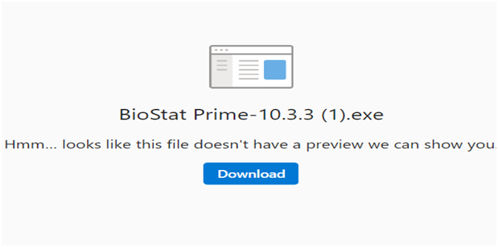
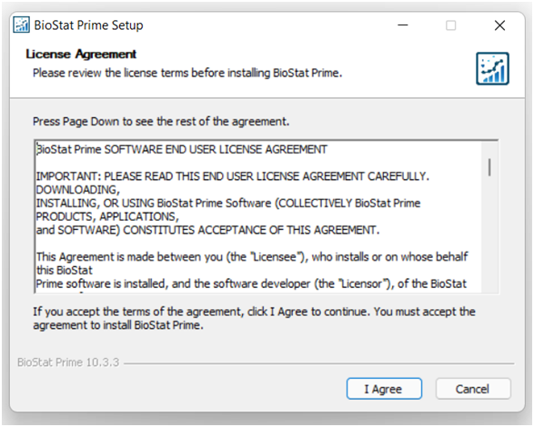
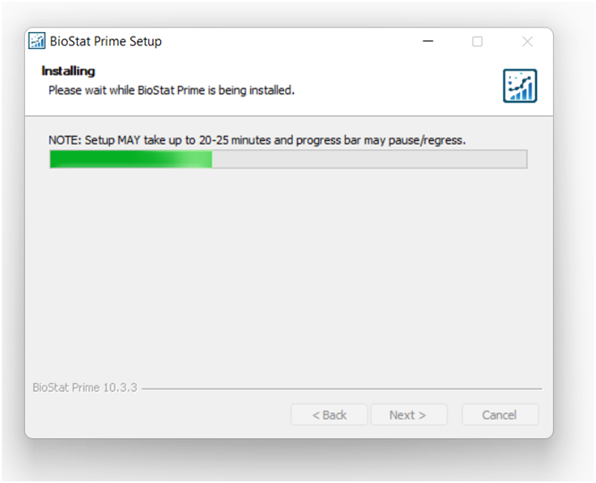

# Installation
<tabs>
<tab title="Windows">

Installing BioStat Prime on Windows.

*	Download the Windows installer of BioStat Prime from the given link.

*	Double-click on download button to download the BioStat Prime on PC/Laptop.

{ width="700" }{ border-effect="rounded" }

*	Click on I agree to proceed to installation.

{ width="700" }{ border-effect="rounded" }

*	Choose the directory where BioStat Prime will be installed and Click on Install to start the installation.

{ width="700" }{ border-effect="rounded" }

*	Depending on user’s machine specifications, the installation may take up to 25 minutes.

{ width="700" }{ border-effect="rounded" }

*	Run BioStat Prime.

{ width="700" }{ border-effect="rounded" }
</tab>

<tab title="Mac OS">

Installing BioStat Prime on Mac.

1.	If user has Mac with Intel chip set, user needs to download and install BioStatPrime-v10- intel.dmg.

2.	If user have Mac with M1 chip set, user needs to download and install BioStatPrime -v10- m1.dmg.

3.	The BioStatPrime application is supported on macOS version Mojave i.e., 10.14.x and higher. If your macOS version is older, user needs to upgrade your OS to 10.14.x (Mojave) or higher.

4.	Download the Mac installer of BioStat Prime from the given link.

5.	From Downloads double-click the BioStatPrime-v10-intel.dmg or BioStatPrime -v10- M1.dmg that you downloaded.

6.	Drag and drop BioStat Prime to your Applications.

7.	Go to Applications and double click BioStat Prime.

8.	Copy the Datasets_and_Demos, BioStatPrime _MarkDown, Docs, R_scripts and R_Markdown folders to a suitable location.

9.	User can see the dialog below confirming that Apple has scanned our code, and no malicious code is found.

</tab>
</tabs>