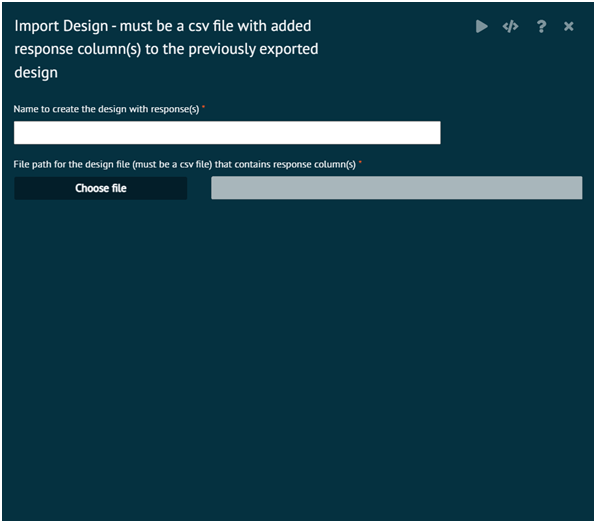

# Import Design Response

Import the Design csv file with added response columns i.e. results recoded from the experiments conducted from the original design previously exported

The purpose of importing the csv file against a design already open in the dataset UI grid is to add the response columns automatically from the csv file to the design in the UI grid and create a new design with the name specified

Once the new design with the response columns is created - this can be analyzed with various analysis methods under __DOE -> Analyze Design__ menu

In addition, designating/un-designating one or more response column(s) can be performed by __DOE -> Modify Design - > Add/Remove Response__ menu

>If the required design is not already opened on the dataset UI grid, using the file Open menu, load the design R object (.rda file) that was previously exported with "Export Design" menu into a directory on the file system.

>For additional information - use R help(add.response, package = DoE.base)
>
{style="note"}

{ width="700" }{ border-effect="rounded" }