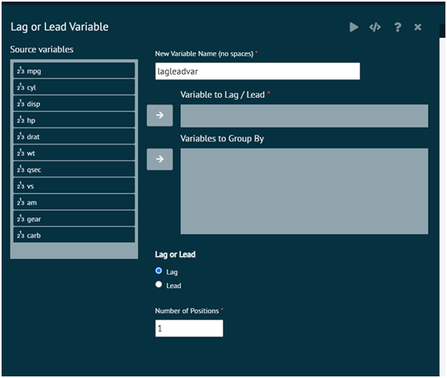

# Lag or Lead Variable
This creates a new variable that finds the previous (lag) or next (lead) value in an existing variable based on the row position.

{ width="700" }{ border-effect="rounded" }

The arguments used is executing the dialog are given as follows.

{type="full"}
__New Variable Name__
: Variable name to store the lagged or leading values

{type="full"}
__Variable to Lag / Lead__
: Specify the existing variable to extract the lagged or leading values from

{type="full"}
__Variables to Group By (optional)__
: Specify the variables to group by. If variables are specified here, the lagged and lead values will be obtained only within groups defined by these variables. If no variables are specified here, the lagged and leading values will be obtained based on the entire column specified in Variable to Lag / Lead. Typically, values should be sorted by the grouping variables prior to doing a lag or lead.

{type="full"}
__Lag or Lead__
: Choose whether user wants to find the previous (lag) or next value (lead)

{type="full"}
__Number of Positions__
: Specify the number of positions to lag or lead by. For example, a lagged value of 1 would extract the previous value and a lagged value of 2 would extract the value 2 positions previous.

>Required R Packages: dplyr
>
{style="note"}
