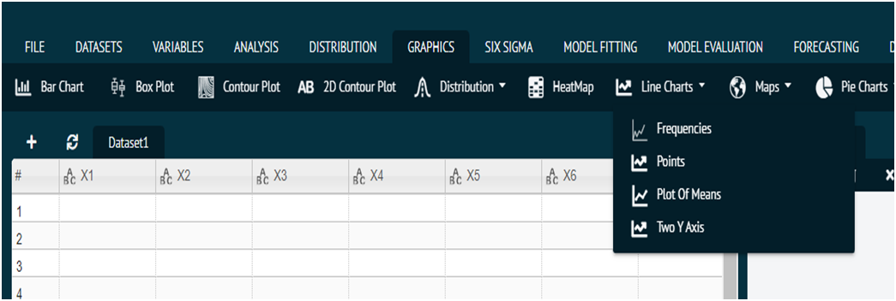
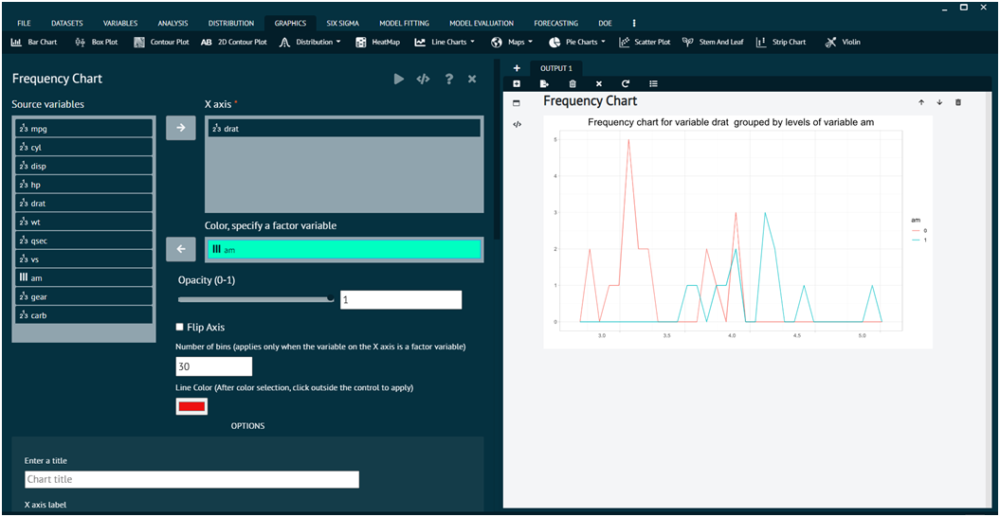
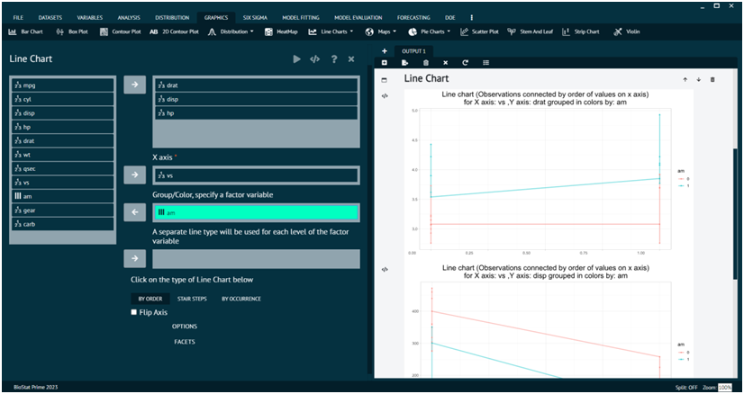
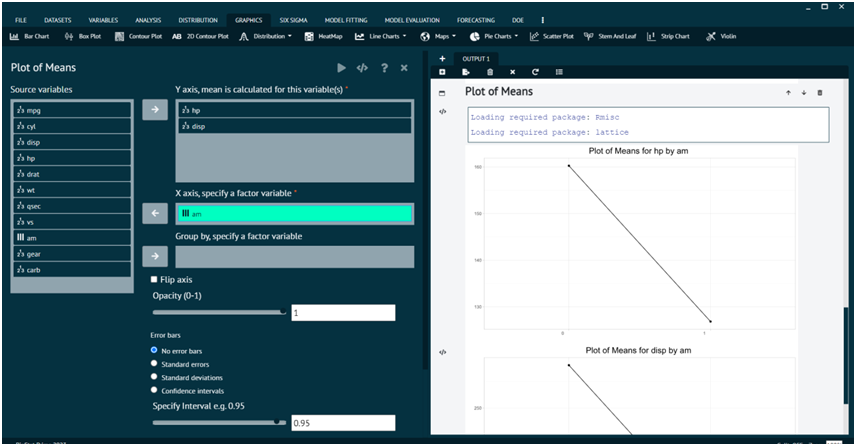
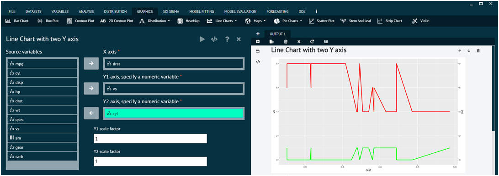

# Line Charts

The Line Charts tab of graphics menu contains 4 options of data visualization i.e., `Frequency Chart`, `Line Chart`, `Plot of Means`, `Two Y Axis`.

{ width="700" }{ border-effect="rounded" }

### Frequency Chart

For representing any dataset in terms of Frequency Chart.

Steps
: __Load the dataset that needs to be visualized -> Go to Graphics -> Line Chart Frequencies -> Put in the values for variables -> Execute the dialog.__

The output of the Frequency Chart of a sample dataset can be seen in the picture below.

{ width="700" }{ border-effect="rounded" }

>The Options tab and Facets tab at the bottom can be utilized to add more features to the output. 
>
{style="note"}

>User can also control opacity, flip axes, no. of bins and line colour of the output.
>
{style="note"}

### Line Chart

For representing any dataset in terms of Line Chart.

Steps
: __Load the dataset that needs to be visualized -> Go to Graphics -> Line Charts Line Chart -> Put in the values for variables -> Execute the dialog.__

The output of the Line Chart of a sample dataset can be seen in the picture below. 

{ width="700" }{ border-effect="rounded" }

>The Options tab and Facets tab at the bottom can be utilized to add more features to the output. 
>
{style="note"}

>User can also flip axes, type of line chart in the output.
> 
{style="note"}

### Plot of Means

For representing any dataset in terms of Plot of Means.

Steps
: __Load the dataset that needs to be visualized -> Go to Graphics -> Line Chart -> Plot ofMeans -> Put in the values for variables -> Execute the dialog.__

The output of the Plot of Means a sample dataset can be seen in the picture below. 

{ width="700" }{ border-effect="rounded" }

>User can also flip axes, Control opacity, error bars, specify intervals for the output.
>
{style="note"}

### Two Y axis

For representing any dataset in terms of Line Chart with two Y axis.

Steps
: __Load the dataset that needs to be visualized -> Go to Graphics -> Line Chart -> Two Y Axis -> Put in the values for variables -> Execute the dialog.__

{ width="700" }{ border-effect="rounded" }
