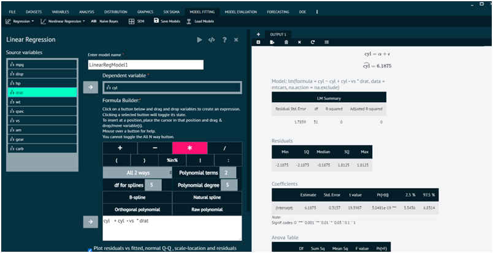
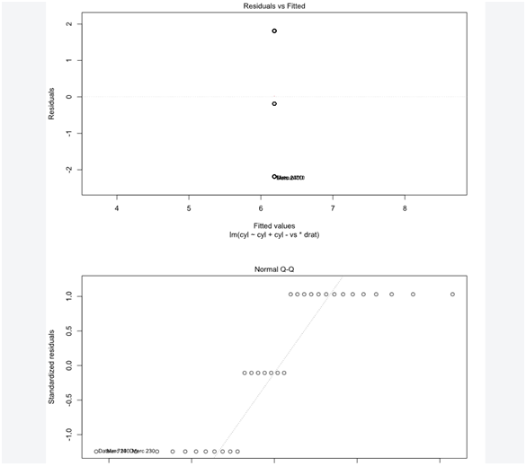

# Linear Regression, Advanced

Builds a linear regression model by creating a formula using the formula builder. Internally calls function lm in stats package. Returns an object called BSkyLinearRegression which is an object of class lm. 

Displays a summary of the model, coefficient table, Anova table and sum of squares table and plots the following residuals vs. fitted, normal Q-Q, theoretical quantiles, residuals vs. leverage.

To analyse it in BioStat Prime user must follow the steps as given.

Steps
: __Load the dataset -> Click on the Model Fitting tab in main menu -> Select Regression -> This leads to analysis techniques, choose Linear, Advanced -> There will appear a dialog -> Select the model name, dependent variables and populate a formula in the dialog -> Check the radio button to display a plot in the output -> Finally execute the plot and visualise the output in output window.__

{ width="700" }{ border-effect="rounded" }

{ width="700" }{ border-effect="rounded" }

> Using Formula Builder: A Guide
>1.	To create an expression, click one of the buttons below and drag & drop variables.
>2.	Toggle the selected button's state by clicking it.
>3.	Place the cursor where user wants to insert the variable(s) and drag and drop or move it there.
>4.	Touch a button to see assistance.
>5.	The All N way button is not able to be toggled.

## Arguments

depVar
: Name of the dependent variable. If we have a dataset cars, with a variable mpg that we want to predict mpg (dependent variable is mpg) enter mpg

indepVars
: Names of the dependent variable. If we have a dataset cars, with dependent variable horsepower, enginesize, enter horsepower+enginesize. Categorical variables are automatically dummy coded.

dataset
: Name of the dataframe. When you open data frames or datasets e.g. csv, Excel files, SAS files in BioStat Prime, they are named Dataset1, Dataset2, Dataset3 so enter Dataset1

