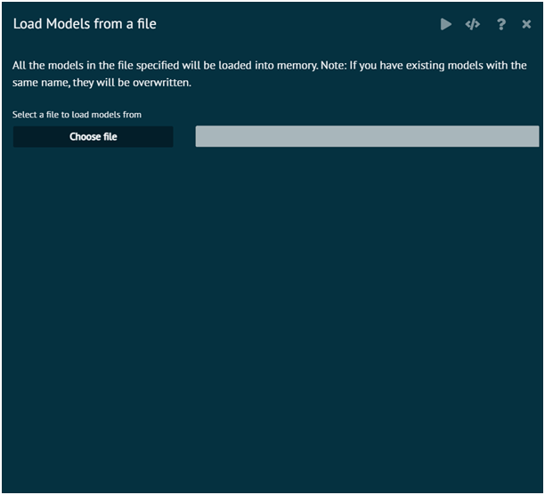

# Load Model from a file

R Model objects saved to the file selected will be loaded. BioStat Prime will load ALL R objects saved to the selected file. If objects with the same name exist in the R global environment, they will be overwritten.

BioStat Prime will display a message confirming the models built with the BioStat application that were loaded.

User has to click the execute button (the horizontal triangle button) to load R objects saved to the selected file.

{ width="700" }{ border-effect="rounded" }

## Arguments

file
: file name with path, the model objects selected will be saved to this RData file

>For detailed help click on the R icon on the top right hand side of the help dialog overlay
> 
{style="note"}