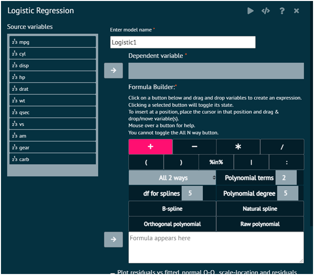

# Logistic Regression, Advanced

Logistic regression is a data analysis technique that uses mathematics to find the relationships between two data factors. It then uses this relationship to predict the value of one of those factors based on the other. The prediction usually has a finite number of outcomes, like yes or no.

To analyse it in BioStat Prime user must follow the steps as given.

Steps
: __Load the dataset -> Click on the Model Fitting tab in main menu -> Select Regression -> This leads to analysis techniques, choose Logistics, Advanced -> There will appear a dialog -> Select the model name, dependent variables and independent variable in the dialog -> Check the radio buttons to display a plot in the output -> Finally execute the plot and visualise the output in output window.__

{ width="700" }{ border-effect="rounded" }

>NOTE
> : When specifying a variable containing weights, be aware that since we use the option na.exlude to build the model, all NA values are automatically removed from the dependent and independent variables.

This can cause a mismatch as NA values are NOT automatically removed from the weighting variable.
In this situation you will see the error variable lengths differ (found for (weights))

>To address this error go to Variables>Missing Values>Remove NAs and select the dependent, independent variables and the weighting variable to remove missing values from and rebuild the model.
> 
{style="note"}

## Arguments

depVar
: Name of the dependent variable. If we have a dataset cars, with a variable class that we want to predict (dependent variable is class) enter class

indepVars
: Names of the independent variable, separated by +. If we have a dataset cars, with independent variable horsepower, enginesize, specify horsepower+enginesize). Categorical variables are automatically dummy coded.

data
: Name of the dataframe. When you open data frames or datasets e.g. csv, Excel files, SAS files in BioStat Prime, they are named Dataset1, Dataset2, Dataset3 So enter data=Dataset1.