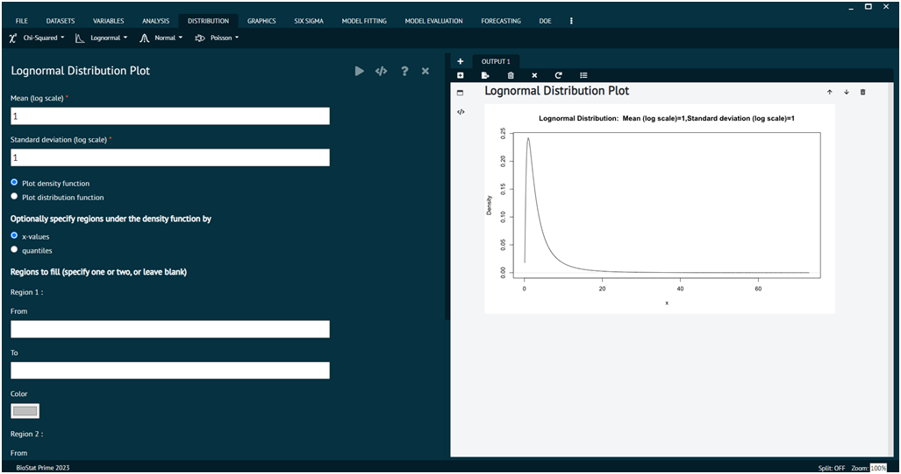

# Lognormal

## Lognormal Distribution Plot

The lognormal distribution is a continuous probability distribution of a random variable whose logarithm is normally distributed. In other words, if X follows a lognormal distribution, then Y= ln(X) follows a normal (Gaussian) distribution. The lognormal distribution is often used to model the distribution of random variables that are the product of many independent and identically distributed random variables.

To analyse it in BioStat user must follow the steps as given.

Steps
: __Load the dataset -> Click on the Distribution tab in main menu -> Select Lognormal -> Select Lognormal Distribution-> This leads to analysis techniques in the dialog -> In the dialog window select the options according to the requirements then execute -> The output will be represented in output window.__

{ width="700" }{ border-effect="rounded" }

Density, distribution function, quantile function and random generation for the log normal distribution whose logarithm has mean equal to meanlog and standard deviation equal to sdlog.

#### Usage
>dlnorm(x, meanlog = 0, sdlog = 1, log = FALSE)
> 
{style=note}

>plnorm(q, meanlog = 0, sdlog = 1, lower.tail = TRUE, log.p = FALSE)
>
{style=note}

>qlnorm(p, meanlog = 0, sdlog = 1, lower.tail = TRUE, log.p = FALSE)
>
{style=note}

>rlnorm(n, meanlog = 0, sdlog = 1)
> 
{style=note}

#### Value

dlnorm gives the density, plnorm gives the distribution function, qlnorm gives the quantile function, and rlnorm generates random deviates.

The length of the result is determined by n for rlnorm, and is the maximum of the lengths of the numerical arguments for the other functions.

The numerical arguments other than n are recycled to the length of the result. Only the first elements of the logical arguments are used.

## Lognormal Probabilities

To analyse it in BioStat user must follow the steps as given.

Steps
: __Load the dataset -> Click on the Distribution tab in main menu -> Select Lognormal -> Select Lognormal Probabilities -> This leads to analysis techniques in the dialog -> In the dialog window select the options according to the requirements then execute -> The output will be represented in output window.__

.png){ width="700" }{ border-effect="rounded" }

## Lognormal Quantiles

To analyse it in BioStat user must follow the steps as given.

Steps
: __Load the dataset -> Click on the Distribution tab in main menu -> Select Lognormal -> Select Lognormal Quantiles -> This leads to analysis techniques in the dialog -> In the dialog window select the options according to the requirements then execute -> The output will be represented in output window.__

.png){ width="700" }{ border-effect="rounded" }

## Sample from Lognormal Distribution

To analyse it in BioStat user must follow the steps as given.

Steps
: __Load the dataset -> Click on the Distribution tab in main menu -> Select Lognormal -> Select Sample from Lognormal Distribution -> This leads to analysis techniques in the dialog -> In the dialog window select the options according to the requirements then execute -> The output will be represented in output window.__

.png){ width="700" }{ border-effect="rounded" }

