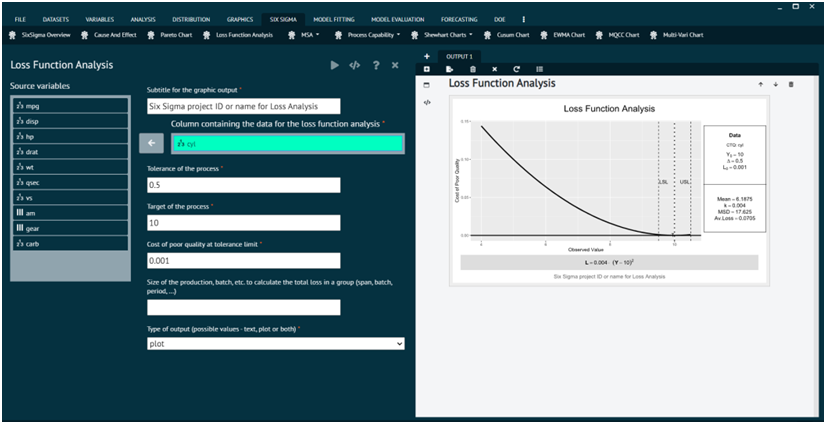

# Loss Function Analysis

To analyse Loss Function Analysis in BioStat user must follow the steps given below.

__Load the dataset -> Click on the Six Sigma tab in main menu -> Select Loss Function Analysis -> This leads to analysis techniques in the dialog -> Selected the various options in the dialog according to the requirement -> Execute and visualise the output in output window.__

{ width="700" }{ border-effect="rounded" }
