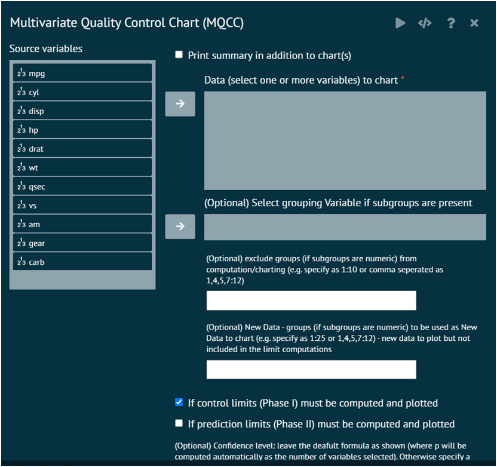

# MQCC Chart

The MQCC Chart (Moving Average Quality Control Chart) is not a widely recognized term in traditional statistics or quality control literature. However, I believe you might be referring to a Moving Average Quality Control Chart (MAQCC), or simply a Moving Average Chart (MA Chart). These charts are used in statistical process control (SPC) to monitor the performance of a process over time.

To analyse MQCC chart in BioStat user must follow the steps given below.

Steps
: __Load the dataset -> Click on the Six Sigma tab in main menu -> Select MQCC chart -> This leads to analysis techniques in the dialog -> Selected the various options in the dialog according to the requirement -> Execute and visualise the output in output window.__

{ width="700" }{ border-effect="rounded" }
