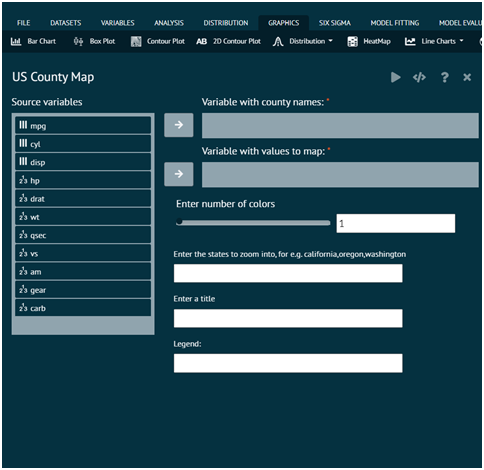
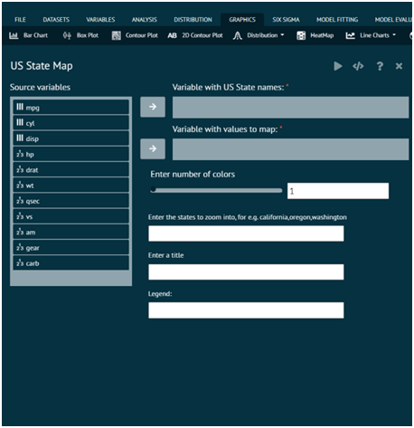
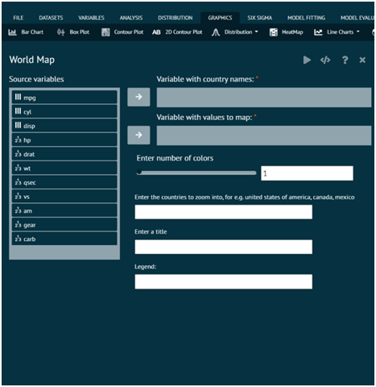

# Maps

This section of graphics tab provides user the ability to visualize maps. 

Once the appropriate dataset is loaded, user can see a plot for `US Country map`, `US State map`, `World Map`.

{ width="700" }{ border-effect="rounded" }

{ width="700" }{ border-effect="rounded" }

{ width="700" }{ border-effect="rounded" }
