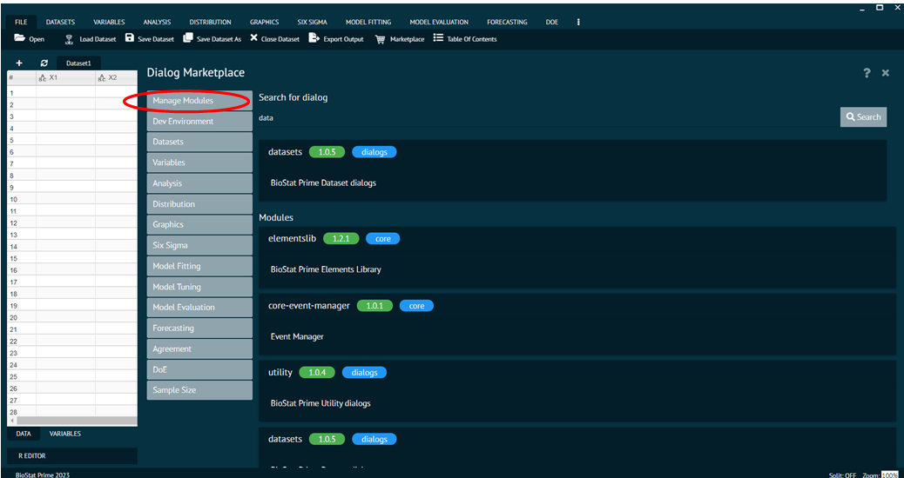
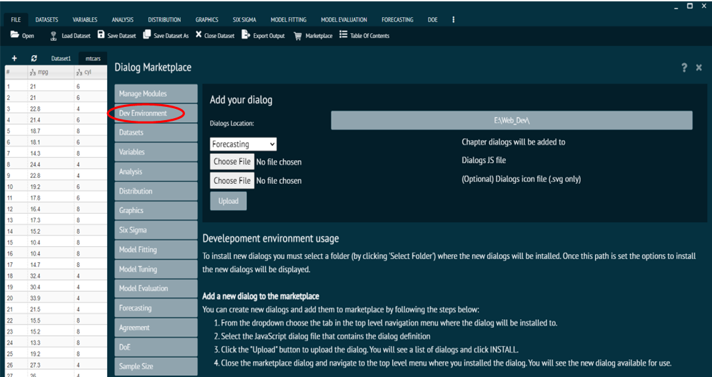
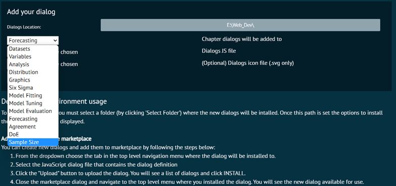
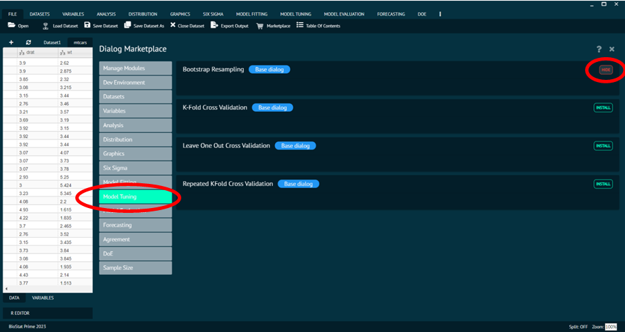
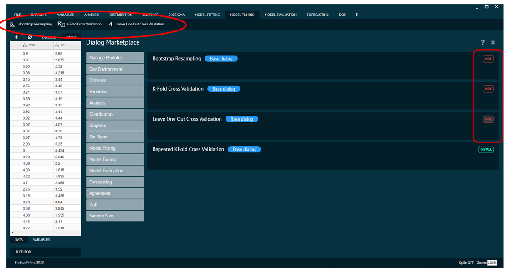
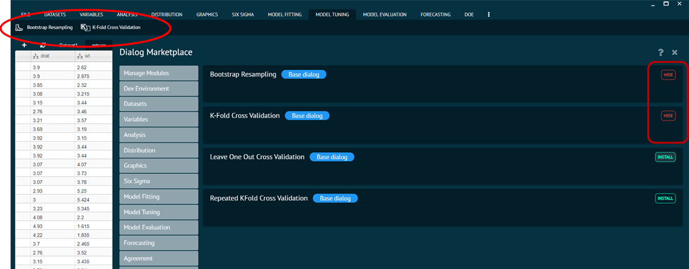

# Marketplace

## How to use Marketplace

One of BioStat Prime's signature features is the Marketplace, which lets users customize the program to suit their needs and increase its usefulness. The Marketplace is a free shop where R functions and libraries can be added to BioStat Prime to cover more recent statistical topics. R functions and packages are either installed or hidden.

## Manage Modules

The marketplace's top most option is Manage Modules. It is in charge of looking for dialogs in the marketplace that is accessible.

{ width="700" }{ border-effect="rounded" }

## Dev Environments

To install the new dialogs, users needs to go to the Dev Environment tab in Marketplace section and must pick the location (by clicking "Select Folder") where they want to be installed -> Once the place is specified, the options to install the new dialogs will show up -> Select the tab in the top level navigation menu where the dialog will be installed from the dropdown menu -> Choose the JavaScript dialog file containing the definition of the dialog -> To upload the dialog, click the "Upload" button -> After selecting INSTALL, a list of dialogs will appear -> After closing the marketplace dialog, user needs to select the dialog installed from the top-level menu -> The new dialog will appear and will be usable.

{ width="700" }{ border-effect="rounded" }

Selecting the tab where the dialog will be installed.

{ width="700" }{ border-effect="rounded" }

## Installing R Libraries from Marketplace

To enable a new Menu and sub menu in BioStat Prime, user needs to install the R libraries from marketplace. The steps to take the same are as follows.

Steps
: __Go to file Menu -> Marketplace -> Choose the package to be installed (say Model Tuning) -> Click install next to respective functions that user wants in the sub menus.__

BioStat Prime will add the library in the main menu and its functions in sub menu.

{ width="700" }{ border-effect="rounded" }

As the user proceeds to install the packages, the functions appear in the main menu and sub menu.

{ width="700" }{ border-effect="rounded" }

User can hide the sub function whenever needed, by clicking the hide button next to the respective function in marketplace.

{ width="700" }{ border-effect="rounded" }