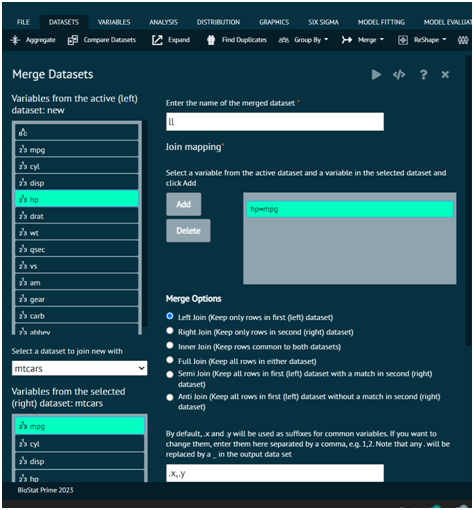
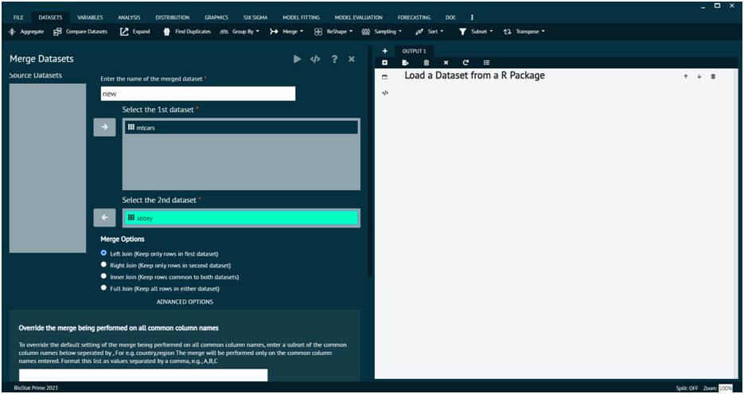
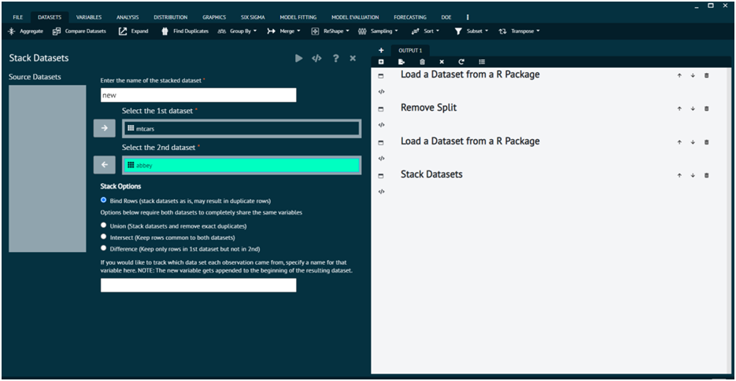
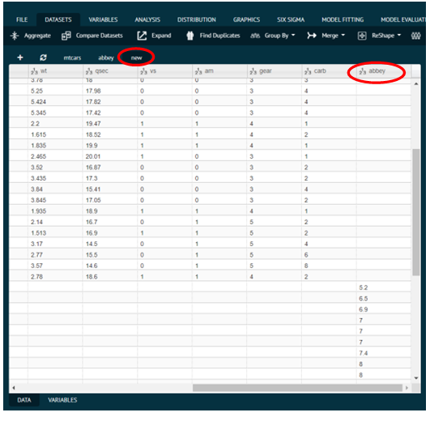
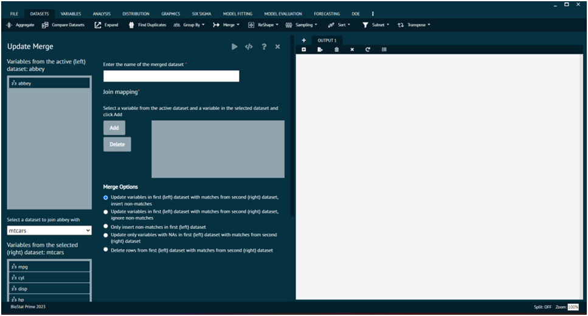

# Merge

Merge datasets will help user join 2 datasets together.
User need to specify one or more variables in the active dataset and in the selected target dataset that you want the join to be performed on.
> The results will be saved in a new dataset.
>
{style="note"}
> Merge Options
> 1. inner_join: return all rows from x where there are matching values in y, and all columns from x and y. If there are multiple matches between x and y, all combination of the matches are returned.
> 2. left_join: return all rows from x, and all columns from x and y. Rows in x with no match in y will have NA values in the new columns. If there are multiple matches between x and y, all combinations of the matches are returned.
> 3. right_join: return all rows from y, and all columns from x and y. Rows in y with no match in x will have NA values in the new columns. If there are multiple matches between x and y, all combinations of the matches are returned.
> 4. full_join: return all rows and all columns from both x and y. Where there are not matching values, returns NA for the one missing.
> 5. semi_join: Keep all rows in first dataset with a match in second dataset
> 6. anti_join: Keep all rows in first dataset without a match in second dataset

This section id dataset tab has 4 options that are explained as follows.

### Merge

Merge datasets will help user to join 2 datasets together. By default, this dialog will look for common variable names within the 2 datasets and merge on the full set of common variables.
To perform this operation in BioStat Prime user needs to follow the steps given bellow.

{type="full"}
Steps
:
__Load the datasets -> click on the DATASET tab in main menu -> select MERGE -> select MERGE from the drop-down -> Once the dialog appears choose the Variables from each dataset -> add them to join the mapping -> Execute the dialog.__

{ width="700" }{ border-effect="rounded" }

>R Package Required: dplyr
> 
{style="note"}

### Merge (legacy)

{ width="700" }{ border-effect="rounded" }

### Stack
This dialog will help user to stack 2 datasets on top of each other. User can select one of the following options.

{type="full"}
Steps
:
1. Bind Rows: Stacks the 2 datasets exactly as they are. If a variable name is common to both datasets, values will fill in as user expects. If a dataset A contains a variable say var1 that is not present in the other dataset B, NA's will appear in variable var1 for all rows that correspond to dataset B.
   All options below require that both datasets share the same variables.
2. Union: stacks the datasets and removes duplicates
3. Intersect: keeps rows common to both
4. Difference: Keeps rows in 1st dataset, not in 2nd
   Depending on the option selected, the functions bind_rows, union, intersect and setdiff in the package dplyr are called. 

> User can optionally track which dataset the original observation came from. The dataset ID (1st/2nd) is appended to the beginning of the dataset that contains the results.
>
{style="note"}

{ width="700" }{ border-effect="rounded" }

{ width="700" }{ border-effect="rounded" }

### Merge Update
Description
Update merge updates a dataset with values from a second dataset based on exact variable name matching for observations with matching join mapping variable values.
You need to specify one or more variables in the active dataset and in the selected target dataset that you want the join to be performed on.
The results will be saved in a new dataset.

#### Merge Options

##### Update variables in first (left) dataset with matches from second (right) dataset, insert non-matches: 
This is a combination of updating variables in the left dataset for matches and creating new rows for unmatched rows.

##### Update variables in first (left) dataset with matches from second (right) dataset, ignore non-matches: 
This only updates existing variables in the left datasets for matches. Unmatched rows are ignored.

##### Only insert non-matches in first (left) dataset: 
This leaves intact all matching rows in the left dataset. Only non-matching rows from the right dataset are added to the left dataset.

##### Update only variables with NAs in first (left) dataset with matches from second (right) dataset, ignore non-matches: 
This updates rows that match, but only when the values in the left dataset are NA (i.e. are missing values).

##### Delete rows from first (left) dataset with matches from second (right) dataset: 
This only deletes rows from the left dataset that match rows in the right dataset.

>R Packages Required: dplyr
>
{style="note"}

{ width="700" }{ border-effect="rounded" }

