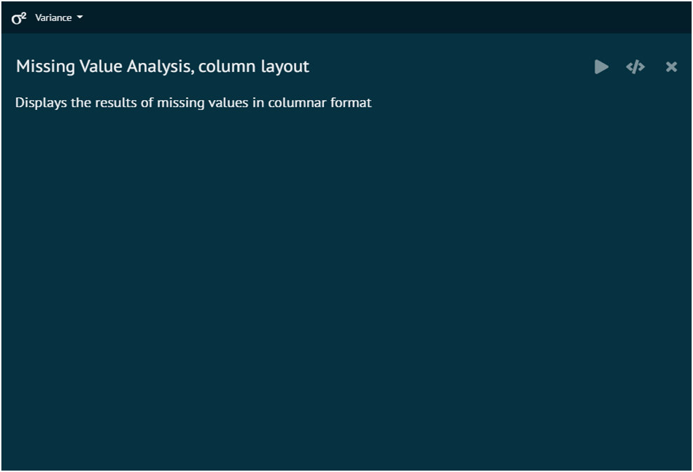
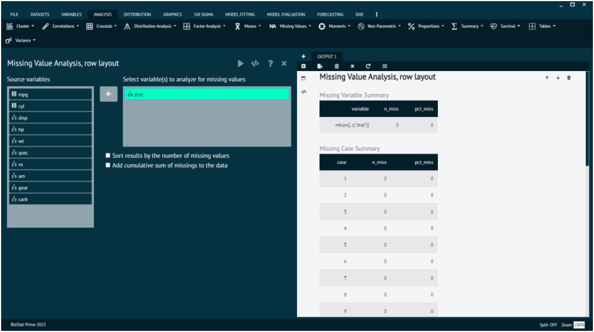

# Missing Value

#### Column layout

To analyse it in BioStat Prime user must follow the steps as given.

__Load the dataset -> Click on the analysis tab in main menu -> Select missing values -> The missing values tab leads to column layout in the dialog -> Execute the dialog.__

{ width="700" }{ border-effect="rounded" }

#### Row layout

Missing value analysis is an essential step in data preprocessing, helping you understand and handle missing data in your dataset. The "row layout" in this context suggests that you are examining missing values on a row-wise basis, looking at how missing values are distributed across individual rows in your dataset.

To analyse it in BioStat Prime user must follow the steps as given.

__Load the dataset -> Click on the analysis tab in main menu -> Select missing values -> The missing values tab leads to row layout in the dialog -> In the dialog select the variable and options according to the requirement -> Execute the dialog.__

{ width="700" }{ border-effect="rounded" }
