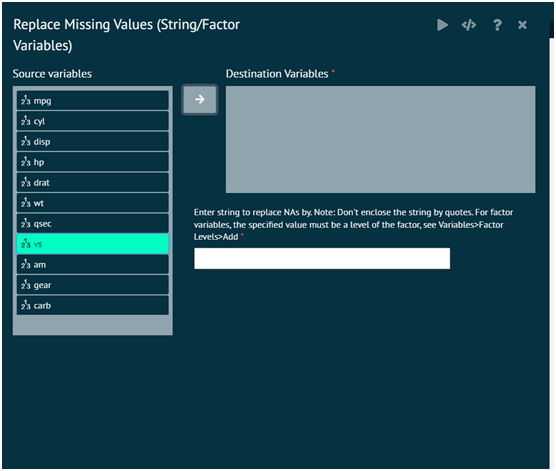
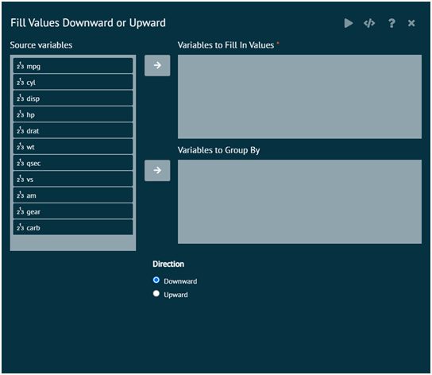
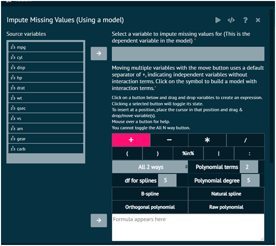
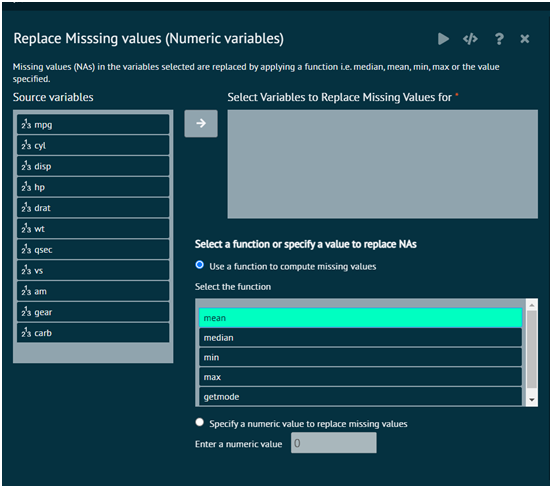
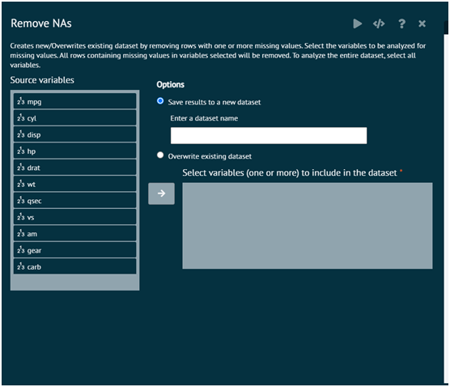
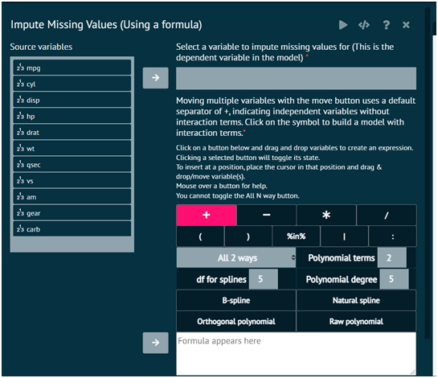

# Missing Values

### Character/Factor
Replace missing values in the variables selected by the specified value. When using the dialog, user doesn't have to enclose the string in double quotes

{ width="700" }{ border-effect="rounded" }

### Fill Values Downward or Upward
This dialog fills in missing values in dataset columns by using the previous entry in each column. This can be useful in cases where values are not repeated, but recorded each time they change. Typically, this means the dataset is sorted in a meaningful way. The variables where values are filled in will be overwritten.

The arguments used is executing the dialog are given as follows.

__Variables to Fill In Values__
: Specify variables for which missing values will be filled in

__Variables to Group By__
: Specify variables that group rows together. Missing values will be filled in within groups defined by these variables. For example, grouping by a subject identifier would fill in values within subjects.

__Direction__
: Specify the direction for which the values will be filled in.

>R Packages Required: tidyverse
>
{style="note"}

{ width="700" }{ border-effect="rounded" }

### Model Imputation
BioStat Prime first constructs a model using the variable to impute values for as the dependent variable.
It then uses the constructed model to predict values and replace missing values in the dependent variable by the predicted values.

{ width="700" }{ border-effect="rounded" }

The simputation package offers a number of commonly used single imputation methods, each with a similar simple interface. The following imputation methodology is supported.
>• linear regression
• robust linear regression
• ridge/elasticnet/lasso regression
• CART models (decision trees)
• Random forest
• Multivariate imputation
• Imputation based on the expectation-maximization algorithm
• missForest (iterative random forest imputation)
• Donor imputation (including various donor pool specifications)
• k-nearest neigbour (based on gower’s distance)
• sequential hotdeck (LOCF, NOCB)
• random hotdeck
• Predictive mean matching
• Model based (optionally add [non]parametric random residual)
• Other
(groupwise) median imputation (optional random residual)

>Proxy imputation: copy another variable or use a simple transformation to compute imputed values.

### Numeric
Replace missing values in variables selected by the operation selected i.e. median, mean, min, max

{ width="700" }{ border-effect="rounded" }

>Arguments

__var__
: Character string representing the numeric variable with missing values (na), for e.g. var = c('sales')

__Dataset__
: The dataset that contains the variable var

### Remove NAs
Remove missing values/NA from dataset/dataframe Creates new/Overwrites existing dataset by removing rows with one or more missing values for the columns/variable names selected

{ width="700" }{ border-effect="rounded" }

Arguments
: ​object: an R object.​

### Impute Missing Values using a formula
Construct a formula to replace missing values. For example user builds a regression model to develop estimates for the missing values, once the equation is generated, user can plug the equation into the dialog and only the missing values in the variable selected will be computed.

{ width="700" }{ border-effect="rounded" }

>Arguments

__var__
: The name of the variable in dataset where missing values are to be replaced for e.g. var=c("sales"). The variable must be of class numeric

__Dataset__
: The dataset/dataframe that contains the variable var

__Expression__
: The expression used to replace the missing value, in the example above its var2*4+ 1.32