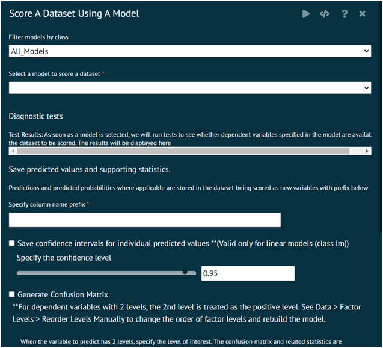

# Predict

Stores predictions with the specified confidence interval in the current dataset using the specified prefix.

### Model Scoring

Model scoring does the following
1. Scores the current dataset using the selected prebuilt model. Stores predictions with the specified confidence interval in the current dataset using the specified prefix.
2. Optionally creates a confusion matrix and a ROC curve
3. In the case where you are scoring a training dataset that contains the dependent variable/variable to predict and and the dependent variable has 2 levels, you have the option to select the reference level/level of interest.
4. The confusion matrix and related statistics are created using the specified level of interest.

{ width="700" }{ border-effect="rounded" }

#### Arguments

modelname
: a model object for which prediction is desired.

prefix
: prefix string that will be used to create new variables containing the predictions.

datasetname
: is the current dataset to score and save predictions to.