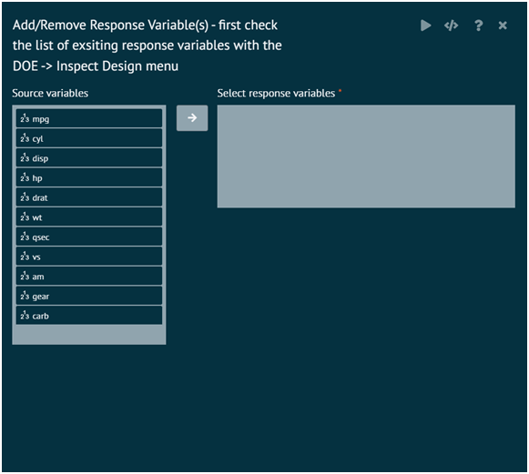
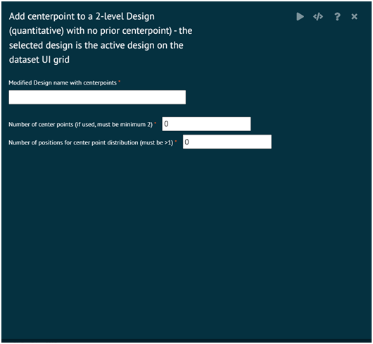

# Modify Design

### Add/Remove Response

This sub function of BioStat Prime designate one or more variables to be response variable(s) for the design

>For the detail help - use R help(response.names, package = DoE.base)
>
{style"note"}

{ width="700" }{ border-effect="rounded" }

### Add Centerpoint 2-Level Design (Quantitative)

This sub function adds centerpoint to a 2-level Design (with no prior centerpoint). The selected design is the active design on the UI grid.

add.center function to add center points to a 2-level fractional factorial design. All factors must be quantitative

>For the detail help - use R help(add.center, package = FrF2)
>
{style="note"}

{ width="700" }{ border-effect="rounded" }
