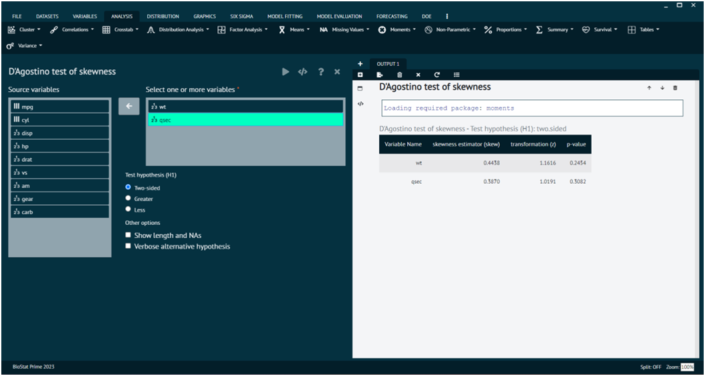

# Moments

#### D’Agostino skewness test

The D'Agostino skewness test is a statistical test used to assess whether the skewness of a sample differs from what would be expected in a normal distribution. Skewness measures the asymmetry of a distribution, indicating whether the data is skewed to the left or right. The D'Agostino skewness test is one of the omnibus tests for normality, alongside tests like the Shapiro-Wilk test and the Anderson-Darling test. These tests are designed to check whether a given sample comes from a normally distributed population.

To analyse it in BioStat Prime user must follow the steps as given.

__Load the dataset -> Click on the analysis tab in main menu -> Select Moments -> The moments tab leads to D’Agostino skewness test in the dialog -> In the dialog select the variable and options according to the requirement -> Execute the dialog.__

{ width="700" }{ border-effect="rounded" }
