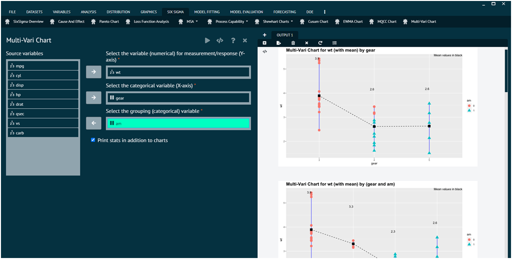

# Multi-Vari Chart

A Multi-Vari Chart is a graphical tool used in statistics, especially in quality control and Six Sigma, to study the variability in a process by displaying multiple sources of variation in one chart.

To analyse Multi-Vari chart in BioStat user must follow the steps given below.

Steps
: __Load the dataset -> Click on the Six Sigma tab in main menu -> Select Multi-Vari chart -> This leads to analysis techniques in the dialog -> Selected the various options in the dialog according to the requirement -> Execute and visualise the output in output window.__

{ width="700" }{ border-effect="rounded" }

