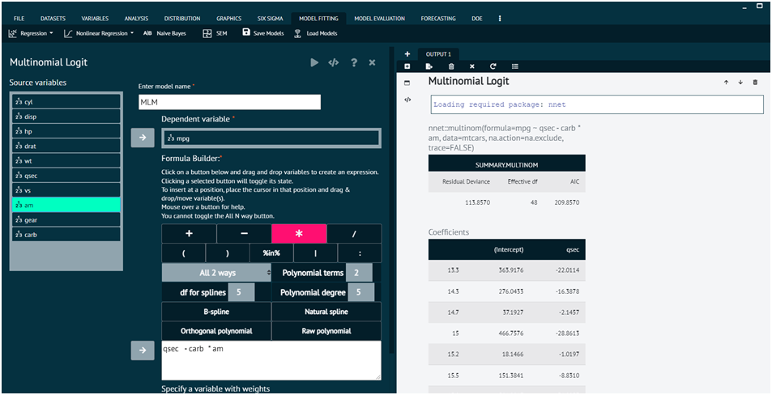

# Multinomial Logit

This function fits multinomial log-linear models via neural networks.

To analyse it in BioStat Prime user must follow the steps as given.

Steps
: __Load the dataset -> Click on the Model Fitting tab in main menu -> Select Regression -> This leads to analysis techniques, choose Multinomial Logit -> There will appear a dialog -> Select the model name, dependent variables, and populate the formula builder in the dialog -> Finally execute the plot and visualise the output in output window.__

> Using Formula Builder: A Guide
>1.	To create an expression, click one of the buttons below and drag & drop variables.
>2.	Toggle the selected button's state by clicking it.
>3.	Place the cursor where user wants to insert the variable(s) and drag and drop or move it there.
>4.	Touch a button to see assistance.
>5.	The All N way button is not able to be toggled.

{ width="700" }{ border-effect="rounded" }

## Arguments

formula
: a formula expression as for regression models, of the form response ~ predictors. The response should be a factor or a matrix with K columns, which will be interpreted as counts for each of K classes. A log-linear model is fitted, with coefficients zero for the first class. An offset can be included: it should be a numeric matrix with K columns if the response is either a matrix with K columns or a factor with K >= 2 classes, or a numeric vector for a response factor with 2 levels. See the documentation of formula() for other details.

data
: an optional data frame in which to interpret the variables occurring in formula.

weights
: optional case weights in fitting.

subset
: expression saying which subset of the rows of the data should be used in the fit. All observations are included by default.

na.action
: a function to filter missing data.

contrasts
: a list of contrasts to be used for some or all of the factors appearing as variables in the model formula.

Hess
: logical for whether the Hessian (the observed/expected information matrix) should be returned.

summ
: integer; if non-zero summarize by deleting duplicate rows and adjust weights. Methods 1 and 2 differ in speed (2 uses C); method 3 also combines rows with the same X and different Y, which changes the baseline for the deviance.

censored
: If Y is a matrix with K columns, interpret the entries as one for possible classes, zero for impossible classes, rather than as counts.

model
: logical. If true, the model frame is saved as component model of the returned object.

... additional arguments for nnet