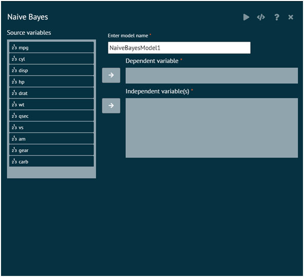

# Naive Bayes

This function computes the conditional a-posterior probabilities of a categorical class variable given independent predictor variables using the Bayes rule.

To analyse it in BioStat Prime user must follow the steps as given.

Steps
: __Load the dataset -> Click on the Model Fitting tab in main menu -> Select Naive Bayes -> There will appear a dialog -> Select the Model name, dependent variables, and independent variable in the dialog -> Fill in the other options. -> Finally execute the plot and visualise the output in output window.__

{ width="700" }{ border-effect="rounded" }

>For detailed help click on the R icon on the top right hand side of the Help dialog overlay
> 
{style="note"}