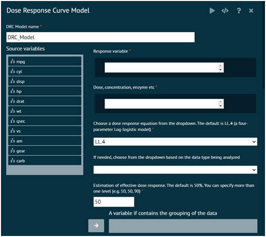
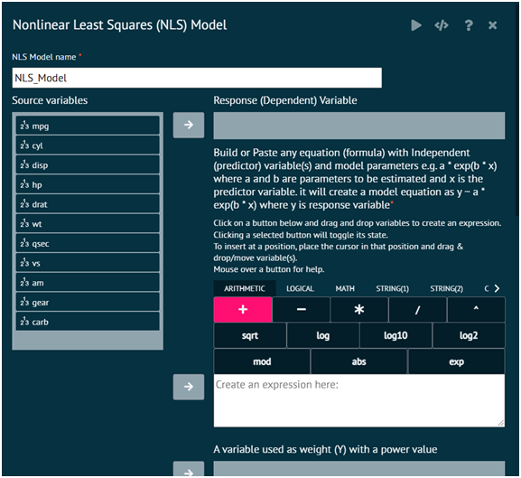
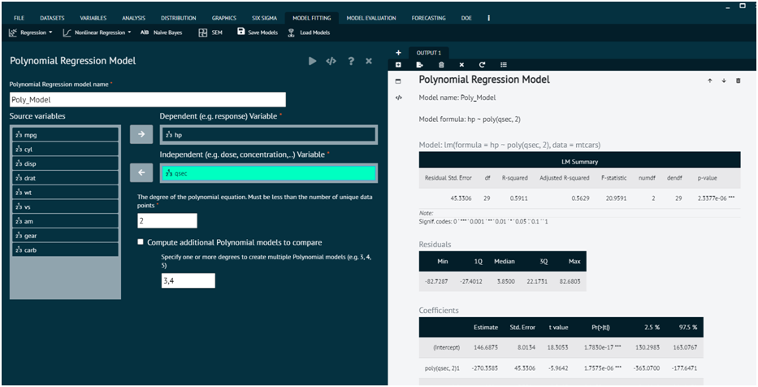
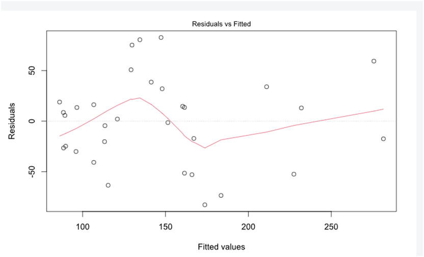

# Non-Linear Regression

### Dose Response Curve

{ width="700" }{ border-effect="rounded" }

### Non-Linear Least Square(NLS) Model

{ width="700" }{ border-effect="rounded" }

### Polynomial Regression Model

{ width="700" }{ border-effect="rounded" }

{ width="700" }{ border-effect="rounded" }
