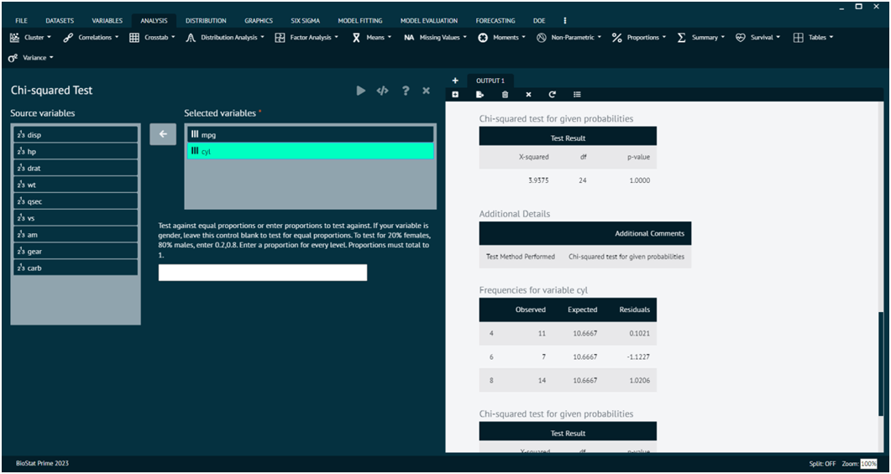
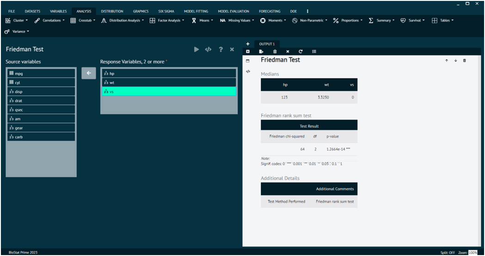
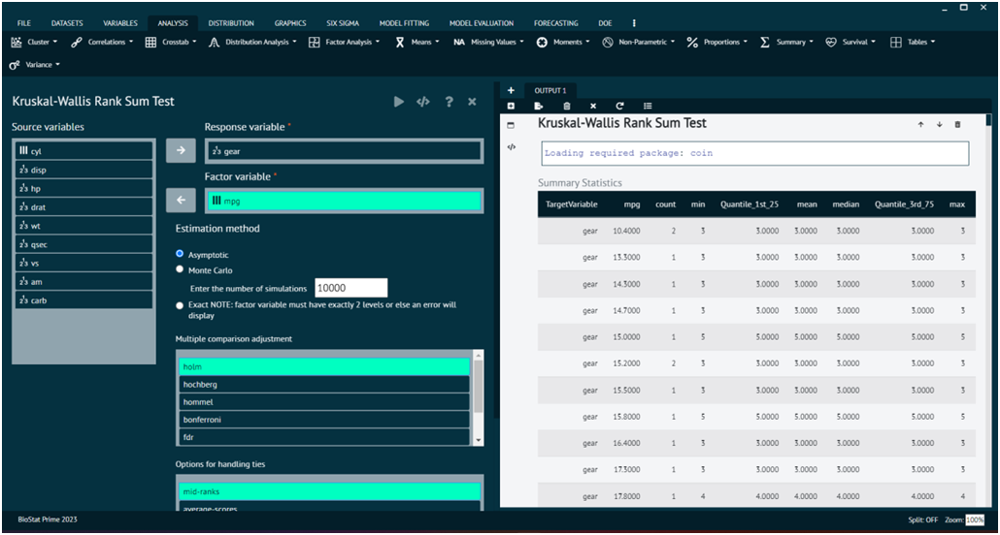
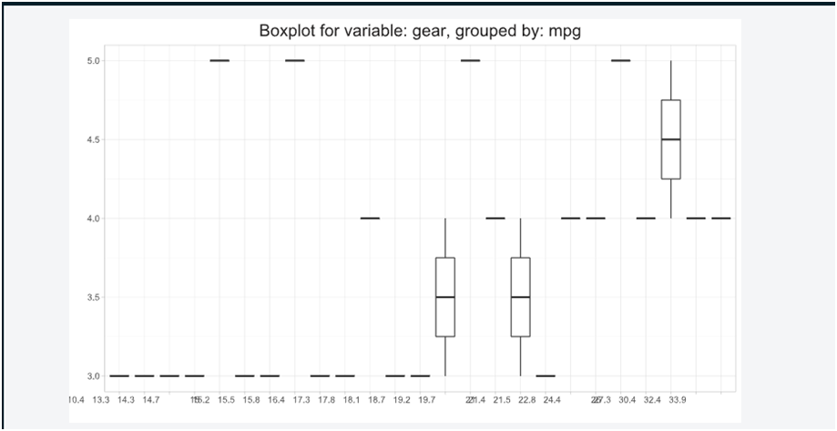
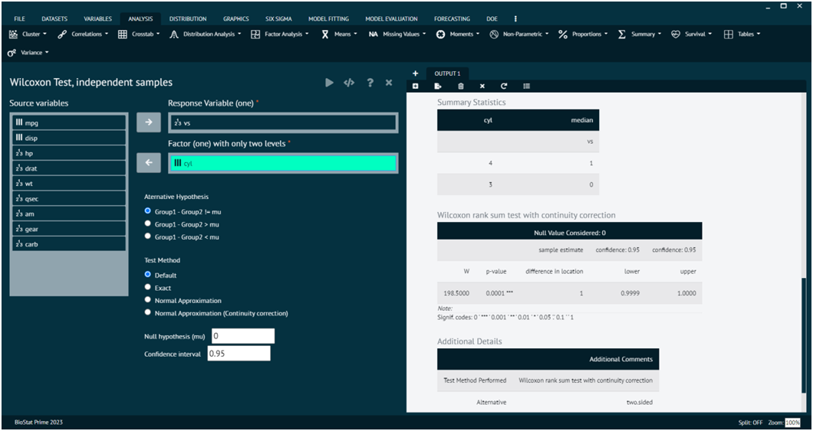
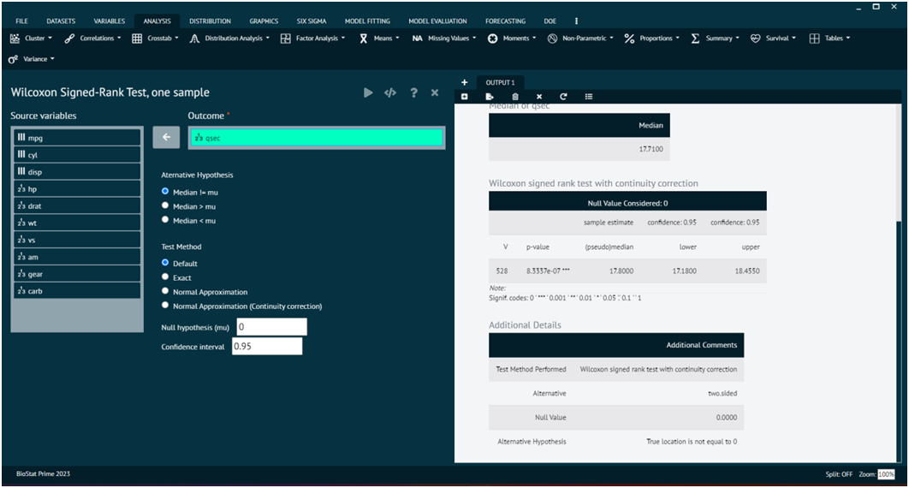
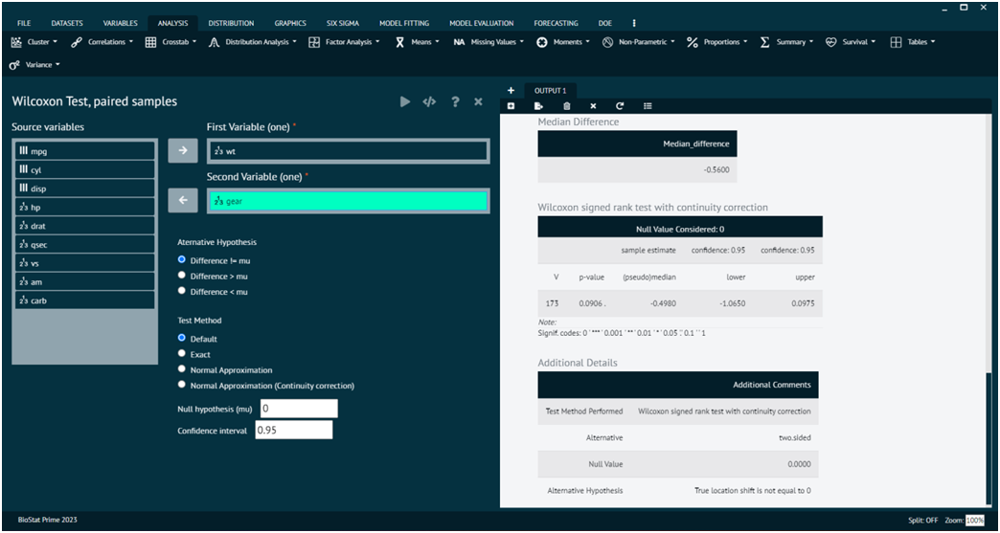

# Non-Parametric

### Chi-Square test

The chi-square test is a statistical test used to determine if there is a significant association between two categorical variables. It is a non-parametric test, meaning it makes no assumptions about the distribution of the data. The test is applicable when the variables are categorical and the data can be presented in a contingency table.

To analyse it in BioStat Prime user must follow the steps as given.

Steps
: __Load the dataset -> Click on the analysis tab in main menu -> Select Non-Parametric -> The non-parametric tab leads to Chi-Square test -> In the dialog select the variable and options according to the requirement -> Execute the dialog.__

{ width="700" }{ border-effect="rounded" }

>Arguments

x
: a numeric vector or matrix. x and y can also both be factors.

y
: a numeric vector; ignored if x is a matrix. If x is a factor, y should be a factor of the same length.

correct
: a logical indicating whether to apply continuity correction when computing the test statistic for 2 by 2 tables: one half is subtracted from all |O - E| differences; however, the correction will not be bigger than the differences themselves. No correction is done if simulate.p.value = TRUE.

p
: a vector of probabilities of the same length of x. An error is given if any entry of p is negative.

rescale.p
: a logical scalar; if TRUE then p is rescaled (if necessary) to sum to 1. If rescale.p is FALSE, and p does not sum to 1, an error is given.

simulate.p.value
: a logical indicating whether to compute p-values by Monte Carlo simulation.

B
: an integer specifying the number of replicates used in the Monte Carlo test.

### Friedman Test

The Friedman test is a non-parametric statistical test used to detect differences in treatment effects among multiple related groups. It is an extension of the Wilcoxon signed-rank test for more than two related samples. The Friedman test is particularly suitable when the data are not normally distributed or when the assumptions of a repeated measures ANOVA are not met.

To analyse it in BioStat Prime user must follow the steps as given.

{type="full"}
Steps
: 
__Load the dataset -> Click on the analysis tab in main menu -> Select Non-Parametric -> The non-parametric tab leads to Friedman Test -> In the dialog select the variable and options according to the requirement -> Execute the dialog.__

{ width="700" }{ border-effect="rounded" }

>Arguments

y
: either a numeric vector of data values, or a data matrix.

groups
: a vector giving the group for the corresponding elements of y if this is a vector; ignored if y is a matrix. If not a factor object, it is coerced to one.

blocks
: a vector giving the block for the corresponding elements of y if this is a vector; ignored if y is a matrix. If not a factor object, it is coerced to one.

formula
: a formula of the form a ~ b | c, where a, b and c give the data values and corresponding groups and blocks, respectively.

data
: an optional matrix or data frame (or similar: see model.frame) containing the variables in the formula formula. By default the variables are taken from environment(formula).

subset
: an optional vector specifying a subset of observations to be used.

na.action
: a function which indicates what should happen when the data contain NAs. Defaults to getOption("na.action").

### Kruskal-Wallis Rank Sum Test

The Kruskal-Wallis test is a non-parametric statistical test used to determine if there are any statistically significant differences between the medians of three or more independent groups.

To analyse it in BioStat Prime user must follow the steps as given.

{type="full"}
Steps
:
__Load the dataset -> Click on the analysis tab in main menu -> Select Non-Parametric -> The non-parametric tab leads to Kruskal-Wallis Rank Sum Test -> In the dialog select the variable and options according to the requirement -> Execute the dialog.__

{ width="700" }{ border-effect="rounded" }

Box plot for variable.

{ width="700" }{ border-effect="rounded" }

>Arguments

Arguments x
: a numeric vector of data values, or a list of numeric data vectors. Non-numeric elements of a list will be coerced, with a warning.

g
: a vector or factor object giving the group for the corresponding elements of x. Ignored with a warning if x is a list.

formula
: a formula of the form response ~ group where response gives the data values and group a vector or factor of the corresponding groups.

data
: an optional matrix or data frame (or similar: see model.frame) containing the variables in the formula formula. By default the variables are taken from environment(formula).

subset
: an optional vector specifying a subset of observations to be used.

na.action
: a function which indicates what should happen when the data contain NAs. Defaults to getOption("na.action").

### Wilcoxon Test, independent samples

The Wilcoxon rank-sum test, also known as the Mann-Whitney U test, is a non-parametric statistical test used to determine whether there is a significant difference between two independent groups. It is often used when the assumptions of the t-test are not met, especially when the data are not normally distributed or when the measurement scale is ordinal.

To analyse it in BioStat Prime user must follow the steps as given.

{type="full"}
Steps
:
__Load the dataset -> Click on the analysis tab in main menu -> Select Non-Parametric -> The non-parametric tab leads to Wilcoxon Test, independent samples -> In the dialog select the variable and options according to the requirement -> Execute the dialog.__

{ width="700" }{ border-effect="rounded" }

>Arguments

x
: numeric vector of data values. Non-finite (e.g., infinite or missing) values will be omitted.

y
: an optional numeric vector of data values: as with x non-finite values will be omitted.

alternative
: a character string specifying the alternative hypothesis, must be one of "two.sided" (default), "greater" or "less". You can specify just the initial letter.

mu
: a number specifying an optional parameter used to form the null hypothesis. See ‘Details’.

paired
: a logical indicating whether you want a paired test.

exact
: a logical indicating whether an exact p-value should be computed.

correct
: a logical indicating whether to apply continuity correction in the normal approximation for the p-value.

conf.int
: a logical indicating whether a confidence interval should be computed.

conf.level
: confidence level of the interval.

formula
: a formula of the form lhs ~ rhs where lhs is a numeric variable giving the data values and rhs a factor with two levels giving the corresponding groups.

data
: an optional matrix or data frame (or similar: see model.frame) containing the variables in the formula formula. By default the variables are taken from environment(formula).

subset
: an optional vector specifying a subset of observations to be used.

na.action
: a function which indicates what should happen when the data contain NAs. Defaults to getOption("na.action").

### Wilcoxon Signed-Rank Test, one sample

The Wilcoxon signed-rank test is a non-parametric statistical test used to assess whether the median of a single sample is different from a specified value (often a hypothesized median). It's particularly useful when the data are not normally distributed or when the measurement scale is ordinal.

To analyse it in BioStat Prime user must follow the steps as given.

{type="full"}
Steps
:
__Load the dataset -> Click on the analysis tab in main menu -> Select Non-Parametric -> The non-parametric tab leads to Wilcoxon Signed-Rank Test, one sample -> In the dialog select the variable and options according to the requirement -> Execute the dialog.__

{ width="700" }{ border-effect="rounded" }

>Arguments

x
: numeric vector of data values. Non-finite (e.g., infinite or missing) values will be omitted.

y
: an optional numeric vector of data values: as with x non-finite values will be omitted.

alternative
: a character string specifying the alternative hypothesis, must be one of "two.sided" (default), "greater" or "less". You can specify just the initial letter.

mu
: a number specifying an optional parameter used to form the null hypothesis. See ‘Details’.

paired
: a logical indicating whether you want a paired test.

exact
: a logical indicating whether an exact p-value should be computed.

correct
: a logical indicating whether to apply continuity correction in the normal approximation for the p-value.

conf.int
: a logical indicating whether a confidence interval should be computed.

conf.level
: confidence level of the interval.

formula
: a formula of the form lhs ~ rhs where lhs is a numeric variable giving the data values and rhs a factor with two levels giving the corresponding groups.

data
: an optional matrix or data frame (or similar: see model.frame) containing the variables in the formula formula. By default the variables are taken from environment(formula).

subset
: an optional vector specifying a subset of observations to be used.

na.action
: a function which indicates what should happen when the data contain NAs. Defaults to getOption("na.action").

### Wilcoxon Test, Paired samples

The Wilcoxon signed-rank test for paired samples is a non-parametric statistical test used to determine if there is a significant difference between the medians of two related groups. It is an alternative to the paired t-test when the assumption of normality is not met, or when dealing with ordinal or non-normally distributed data.

To analyse it in BioStat Prime user must follow the steps as given.

{type="full"}
Steps
:
__Load the dataset -> Click on the analysis tab in main menu -> Select Non-Parametric -> The non-parametric tab leads to Wilcoxon Test, paired samples -> In the dialog select the variable and options according to the requirement -> Execute the dialog.__

{ width="700" }{ border-effect="rounded" }

>Arguments

x
: numeric vector of data values. Non-finite (e.g., infinite or missing) values will be omitted.

y
: an optional numeric vector of data values: as with x non-finite values will be omitted.

alternative
: a character string specifying the alternative hypothesis, must be one of "two.sided" (default), "greater" or "less". User can specify just the initial letter.

mu
: a number specifying an optional parameter used to form the null hypothesis. See ‘Details’.

paired
: a logical indicating whether user want a paired test.

exact
: a logical indicating whether an exact p-value should be computed.

correct
: a logical indicating whether to apply continuity correction in the normal approximation for the p-value.

conf.int
: a logical indicating whether a confidence interval should be computed.

conf.level
: confidence level of the interval.

formula
: a formula of the form lhs ~ rhs where lhs is a numeric variable giving the data values and rhs a factor with two levels giving the corresponding groups.

data
: an optional matrix or data frame (or similar: see model.frame) containing the variables in the formula formula. By default the variables are taken from environment(formula).

subset
: an optional vector specifying a subset of observations to be used.

na.action
: a function which indicates what should happen when the data contain NAs. Defaults to getOption("na.action").