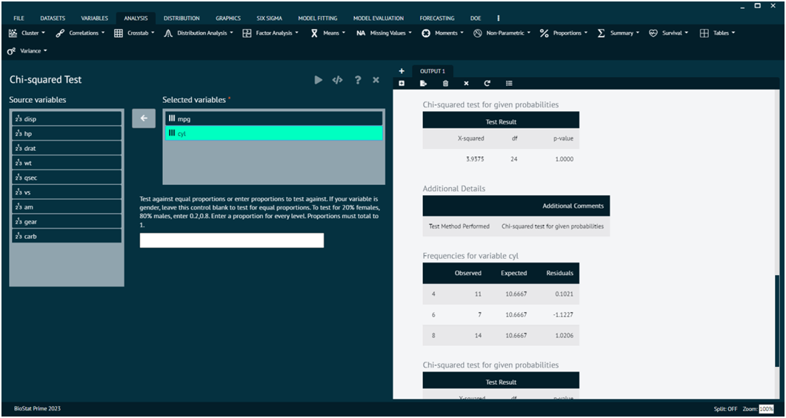
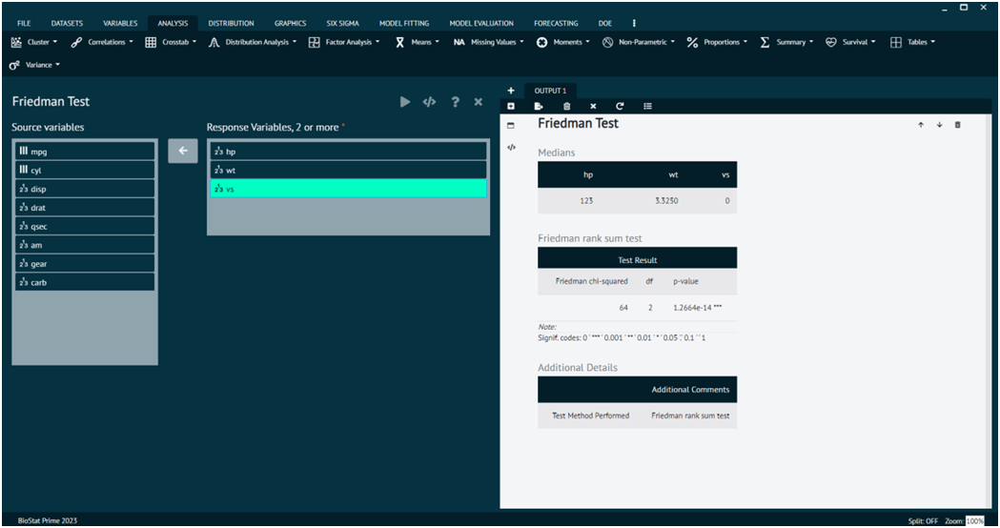
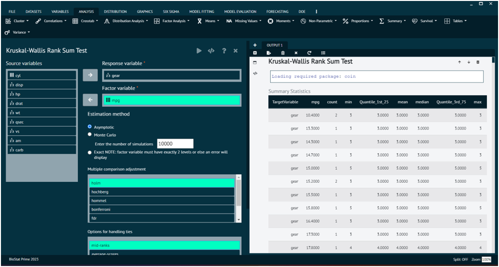
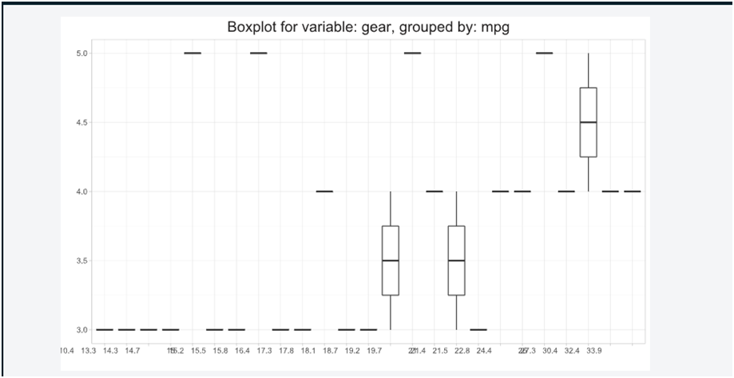
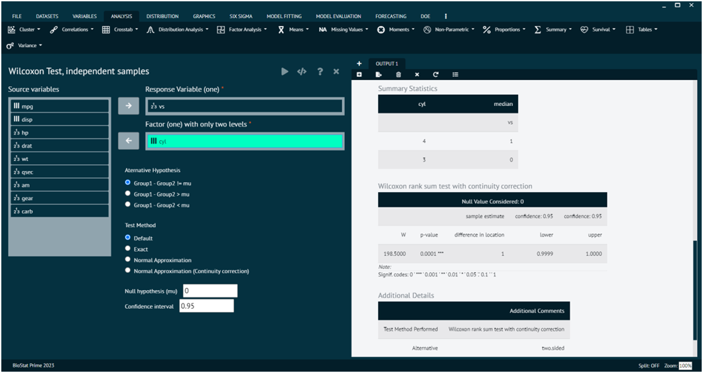
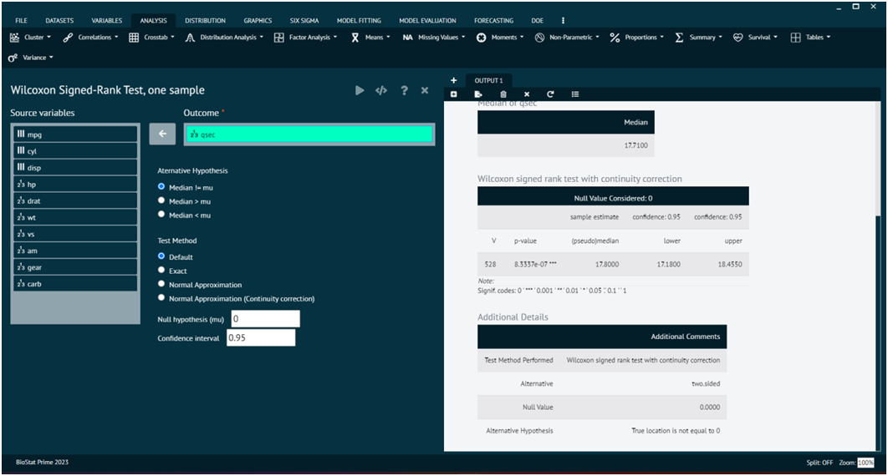
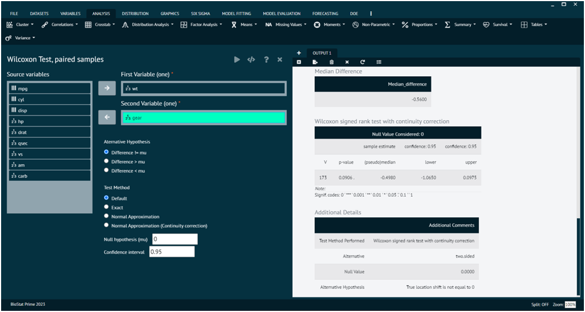

# Non-Parametric

### Chi-Square test

The chi-square test is a statistical test used to determine if there is a significant association between two categorical variables. It is a non-parametric test, meaning it makes no assumptions about the distribution of the data. The test is applicable when the variables are categorical and the data can be presented in a contingency table.

To analyse it in BioStat Prime user must follow the steps as given.

__Load the dataset -> Click on the analysis tab in main menu -> Select Non-Parametric -> The non-parametric tab leads to Chi-Square test -> In the dialog select the variable and options according to the requirement -> Execute the dialog.__

{ width="700" }{ border-effect="rounded" }

### Friedman Test

The Friedman test is a non-parametric statistical test used to detect differences in treatment effects among multiple related groups. It is an extension of the Wilcoxon signed-rank test for more than two related samples. The Friedman test is particularly suitable when the data are not normally distributed or when the assumptions of a repeated measures ANOVA are not met.

To analyse it in BioStat Prime user must follow the steps as given.

__Load the dataset -> Click on the analysis tab in main menu -> Select Non-Parametric -> The non-parametric tab leads to Friedman Test -> In the dialog select the variable and options according to the requirement -> Execute the dialog.__

{ width="700" }{ border-effect="rounded" }

### Kruskal-Wallis Rank Sum Test

The Kruskal-Wallis test is a non-parametric statistical test used to determine if there are any statistically significant differences between the medians of three or more independent groups.

To analyse it in BioStat Prime user must follow the steps as given.

__Load the dataset -> Click on the analysis tab in main menu -> Select Non-Parametric -> The non-parametric tab leads to Kruskal-Wallis Rank Sum Test -> In the dialog select the variable and options according to the requirement -> Execute the dialog.__

{ width="700" }{ border-effect="rounded" }

Box plot for variable.

{ width="700" }{ border-effect="rounded" }

### Wilcoxon Test, independent samples

The Wilcoxon rank-sum test, also known as the Mann-Whitney U test, is a non-parametric statistical test used to determine whether there is a significant difference between two independent groups. It is often used when the assumptions of the t-test are not met, especially when the data are not normally distributed or when the measurement scale is ordinal.

To analyse it in BioStat Prime user must follow the steps as given.

__Load the dataset -> Click on the analysis tab in main menu -> Select Non-Parametric -> The non-parametric tab leads to Wilcoxon Test, independent samples -> In the dialog select the variable and options according to the requirement -> Execute the dialog.__

{ width="700" }{ border-effect="rounded" }

### Wilcoxon Signed-Rank Test, one sample

The Wilcoxon signed-rank test is a non-parametric statistical test used to assess whether the median of a single sample is different from a specified value (often a hypothesized median). It's particularly useful when the data are not normally distributed or when the measurement scale is ordinal.

To analyse it in BioStat Prime user must follow the steps as given.

__Load the dataset -> Click on the analysis tab in main menu -> Select Non-Parametric -> The non-parametric tab leads to Wilcoxon Signed-Rank Test, one sample -> In the dialog select the variable and options according to the requirement -> Execute the dialog.__

{ width="700" }{ border-effect="rounded" }

### Wilcoxon Test, Paired samples

The Wilcoxon signed-rank test for paired samples is a non-parametric statistical test used to determine if there is a significant difference between the medians of two related groups. It is an alternative to the paired t-test when the assumption of normality is not met, or when dealing with ordinal or non-normally distributed data.

To analyse it in BioStat Prime user must follow the steps as given.

__Load the dataset -> Click on the analysis tab in main menu -> Select Non-Parametric -> The non-parametric tab leads to Wilcoxon Test, paired samples -> In the dialog select the variable and options according to the requirement -> Execute the dialog.__

{ width="700" }{ border-effect="rounded" }
