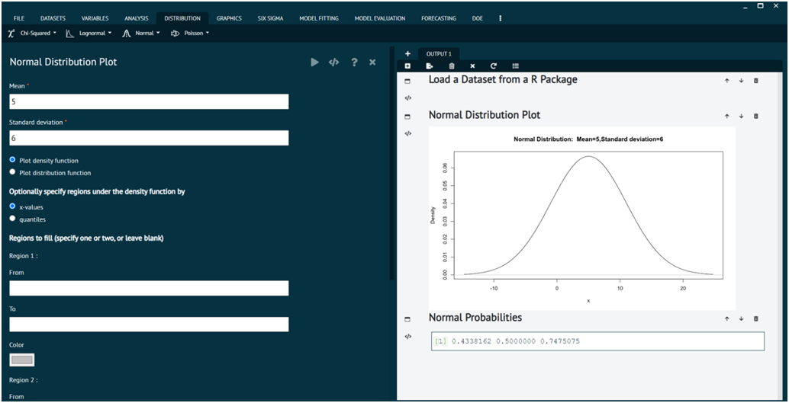
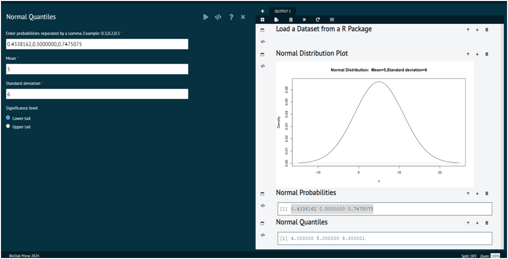

# Normal

In statistics, "normal" typically refers to the normal distribution, also known as the Gaussian distribution. It's a continuous probability distribution that is symmetric around its mean, forming a bell-shaped curve. Many natural phenomena, such as heights, weight, and IQ scores, tend to follow a normal distribution. The normal distribution is characterized by two parameters: the mean (μ) and the standard deviation (σ). The mean determines the center of the distribution, while the standard deviation determines the spread or dispersion of the data points around the mean.

{ width="700" }{ border-effect="rounded" }

### Normal Probabilities

Normal probabilities refer to the probabilities associated with the normal distribution. These probabilities describe the likelihood of observing certain values or ranges of values within a normal distribution.

{ width="700" }{ border-effect="rounded" }

### Normal Quantiles

Normal Quantiles refer to the values that divide a normal distribution into intervals with equal probabilities. These Quantiles are often used in statistical analysis for constructing confidence intervals, hypothesis testing, and understanding the distribution of data.

{ width="700" }{ border-effect="rounded" }

### Sample from Normal Distribution

Sampling from a normal distribution allows you to create synthetic data or simulate random variables that follow a normal distribution, which is useful for various statistical analyses and simulations.

{ width="700" }{ border-effect="rounded" }
