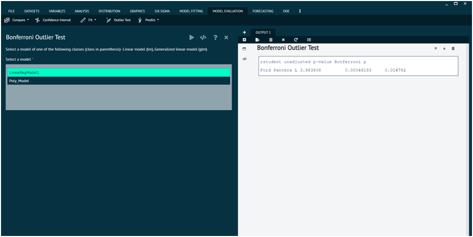

# Outlier Test

## Bonferroni Outlier Test

For a linear model, p-values reported use the t distribution with degrees of freedom one less than the residual df for the model. For a generalized linear model, p-values are based on the standard-normal distribution. The Bonferroni adjustment multiplies the usual two-sided p-value by the number of observations. 

This function reports the Bonferroni p-values for testing each observation in turn to be a mean-shift outlier, based Studentized residuals in linear (t-tests), generalized linear models (normal tests), and linear mixed models.

{ width="700" }{ border-effect="rounded" }

## Arguments

model
: an lm, glm, or lmerMod model object; the "lmerMod" method calls the "lm" method and can take the same arguments.

cutoff
: observations with Bonferroni p-values exceeding cutoff are not reported, unless no observations are nominated, in which case the one with the largest Studentized residual is reported.

n.max
: maximum number of observations to report (default, 10).

order
: report Studenized residuals in descending order of magnitude? (default, TRUE).

labels
: an optional vector of observation names.

...
: arguments passed down to methods functions.

x
: outlierTest object.

digits
: number of digits for reported p-values.
