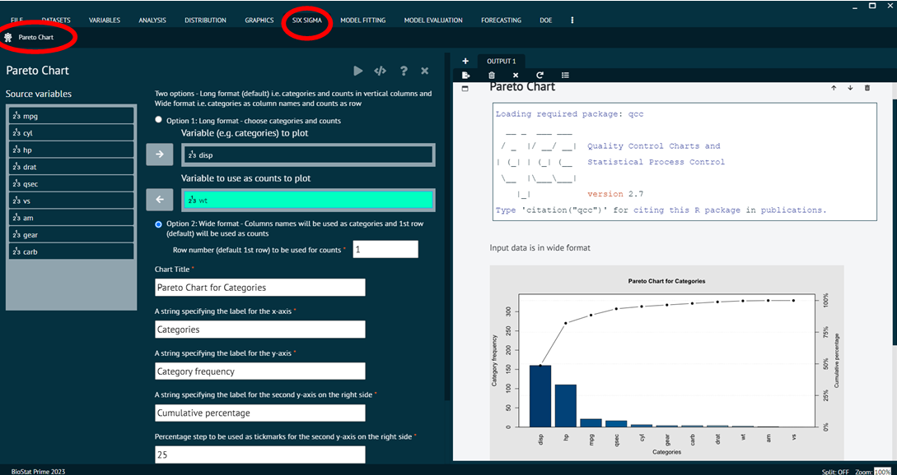

# Pareto Chart

A Pareto chart is a specific type of chart used in statistics that combines both bar and line charts. Pareto chart is designed to highlight the most important factors among a set of variables. The chart is based on the Pareto principle, which states that, __for many phenomena, roughly 80% of the effects come from 20% of the causes__. 

In a Pareto chart, the bars represent individual categories or factors, and they are arranged in descending order from left to right. The cumulative percentage of the total is represented by a line.

To analyse Pareto Chart in BioStat user must follow the steps given below.

Steps
: __Load the dataset -> Click on the Six Sigma tab in main menu -> Select Pareto Chart -> This leads to analysis techniques in the dialog -> Selected the various options in the dialog according to the requirement -> Execute and visualise the output in output window.__

{ width="700" }{ border-effect="rounded" }
