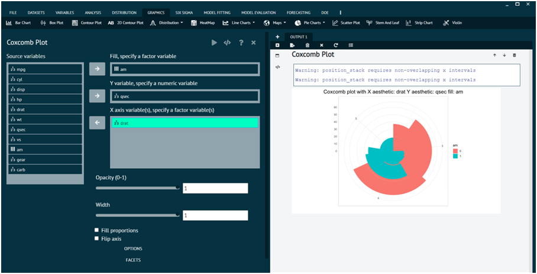
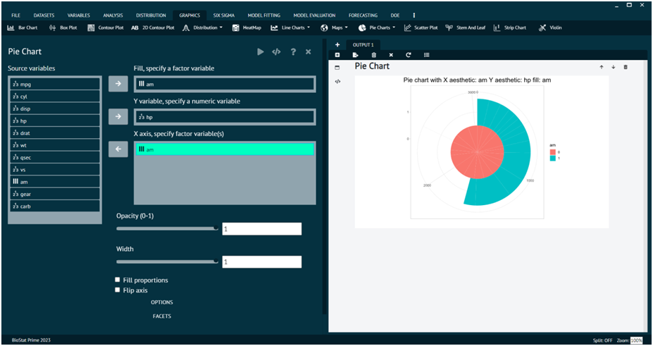

# Pie Charts

The Pie Charts tab of graphics menu contains 2 options of data visualization i.e., `Coxcomb plot`, `PIE Chart`.

### Coxcomb Plot

For representing any dataset in terms of Coxcomb Plot.

Steps
: __Load the dataset that needs to be visualized -> Go to Graphics -> Pie Charts -> Coxcomb Plot -> Put in the values for variables -> Execute the dialog.__

The output of the Coxcomb Plot of a sample dataset can be seen in the picture below.

{ width="700" }{ border-effect="rounded" }

>The Options tab and Facets tab at the bottom can be utilized to add more features to the output.
> 
{style="note"}

>User can also flip axis, fill proportions, control the opacity, width of the pie chart in the output.
>
{style="note"}

### Pie Chart

For representing any dataset in terms of Pie Chart.

Steps
: __Load the dataset that needs to be visualized -> Go to Graphics -> Pie Charts -> Pie Chart -> Put in the values for variables -> Execute the dialog.__

The output of the Pie Chart of a sample dataset can be seen in the picture below.

{ width="700" }{ border-effect="rounded" }
 
>The Options tab and Facets tab at the bottom can be utilized to add more features to the output. 
>
{style="note"}

>User can also flip axis, fill proportions, control the opacity, width of the pie chart in the output.
>
{style="note"}