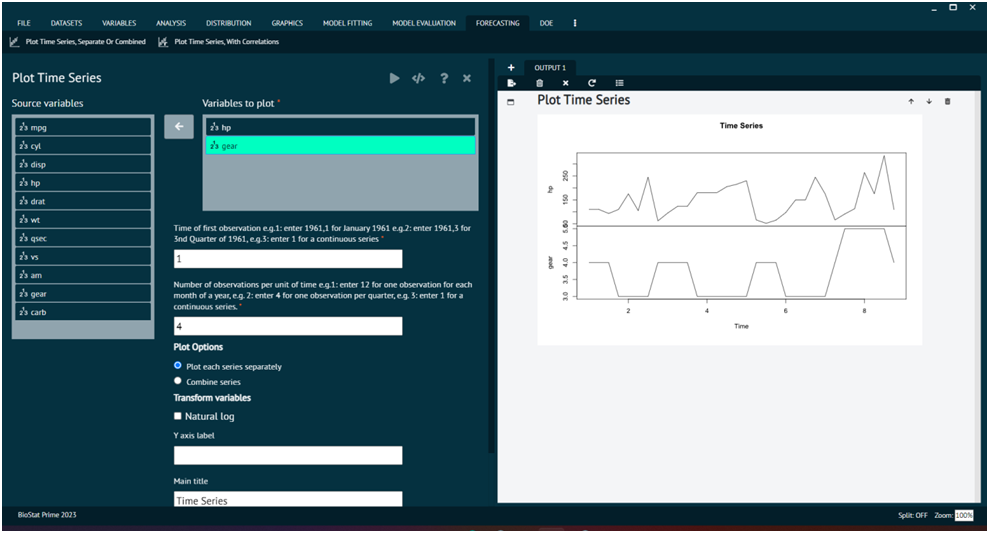

# Plot Time Series, Separate OR Combined

Time series analysis is a crucial component of forecasting, especially when dealing with data that is collected sequentially over time. A time series is a set of observations or data points ordered chronologically. These data points could represent measurements, counts, values, or other observations taken at regular intervals.

This function creates time series plot in combined or separately. When combined multiple variables are plotted together, when separate each variable is plotted independently.

To analyse it in BioStat Prime user must follow the steps as given.

Steps
: __Load the dataset -> Click on the Forecasting tab in main menu -> Select Plot Time Series -> Choose variables to plot -> Write Time of first observation -> Write Number of observations per unit of time -> Execute.__

>The user can choose additional options like transform variables, and plot options to decide whether to plot each series separately or combine the series.

{ width="700" }{ border-effect="rounded" }

## Arguments

vars
: selected variables to plot

start
: Time of first observation should be entered in the format year,month or year,quarter e.g.( if your data is organized in months the 1992,1 for Jan 1992 or if your data is organized in quarters then 1992,1 refers to the first quarter of 1992.

frequency
: Number of observations in unit time. Example: for monthly there are 12 observation in a year. For quarterly there are 4 observation in a year.

plot.type
: "multiple" for separate and "single" for combined plot.

naturalLogYaxis
: if TRUE an Y axis is shown as natural log value.

main
: main title of the plot

ylab
: title for the y axis

dataset
: the name of the dataset from which the vars has been picked.
