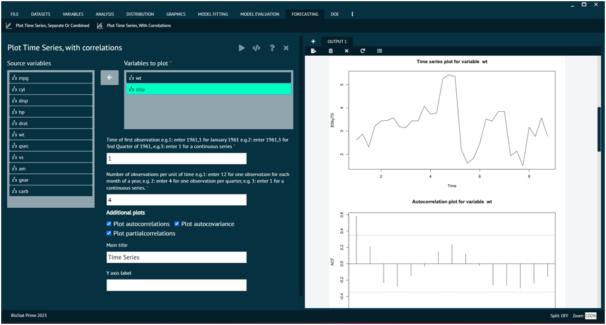

# Plot Time Series with Correlations

When dealing with time series forecasting, the concept of correlation can be relevant, particularly in cases where there are multiple time series, and user want to understand the relationships between them. Correlation measures the strength and direction of a linear relationship between two variables. Correlation analysis can guide the selection of variables for inclusion in forecasting models. Variables with strong correlations might have predictive power and contribute to the accuracy of the model.

To analyse it in BioStat Prime user must follow the steps as given.

__Load the dataset -> Click on the Forecasting tab in main menu -> Select Plot Time Series With Correlations -> Choose variables to plot -> Write Time of first observation -> Write Number of observations per unit of time -> Execute.__

The user can choose additional plot options like autocorrelation, partial correlation, autocovariance. Apart from this user can decide the Y axis label and main title for the plot. In correlation user can opt for additional plots options to get more plots according to the needs and a clear comparison.

{ width="700" }{ border-effect="rounded" }
