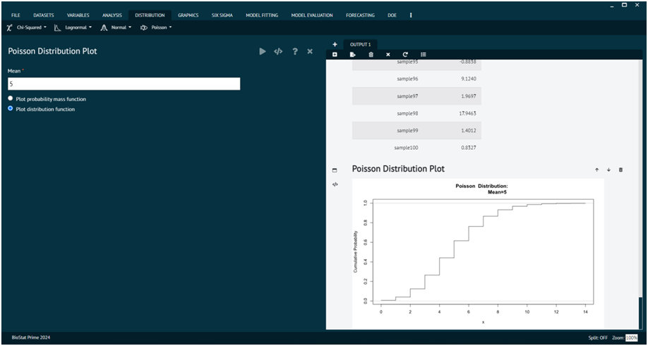
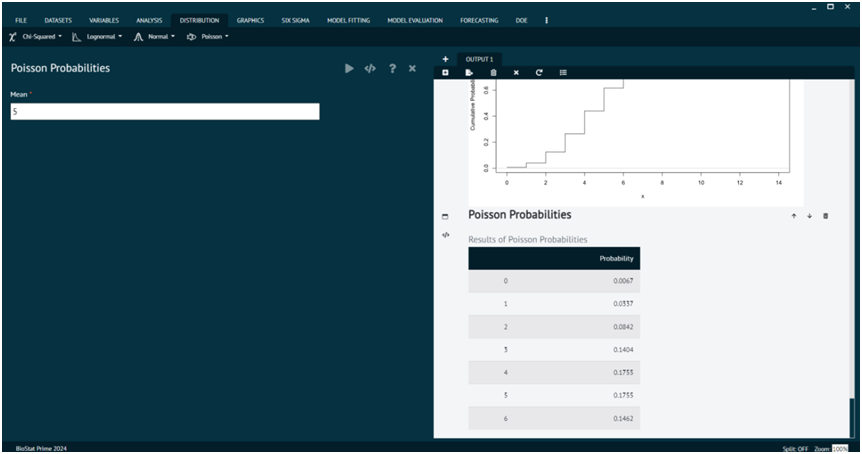
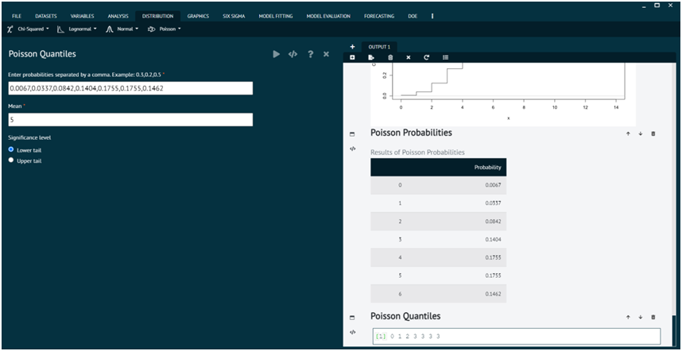

# Poisson

The Poisson distribution is a probability distribution that describes the number of events that occur in a fixed interval of time or space, given a known average rate of occurrence, and assuming that the events occur independently of each other. 

It serves as a fundamental tool in statistical inference, hypothesis testing, and making predictions about future events based on past observations.

### Poisson Distribution Plot

A Poisson distribution plot visually represents the probability distribution of a discrete random variable that represents the number of events occurring in a fixed interval of time or space, given a known average rate of occurrence.
Plot distribution function

{ width="700" }{ border-effect="rounded" }

Plot probability mass function

{ width="700" }{ border-effect="rounded" }

#### Usage
>dpois(x, lambda, log = FALSE)
> 
{style=note}

>ppois(q, lambda, lower.tail = TRUE, log.p = FALSE)
> 
{style=note}

>qpois(p, lambda, lower.tail = TRUE, log.p = FALSE)
> 
{style=note}

>rpois(n, lambda)
> 
{style=note}

#### Details
The Poisson distribution has density
p(x) = λ^x exp(-λ)/x!
for x = 0, 1, 2, … . The mean and variance are E(X) = Var(X) = λ.

>Note that λ = 0 is really a limit case (setting 0^0 = 1) resulting in a point mass at 0, see also the example.

If an element of x is not integer, the result of dpois is zero, with a warning. p(x) is computed using Loader's algorithm, see the reference in dbinom.

The quantile is right continuous: qpois(p, lambda) is the smallest integer x such that P(X ≤ x) ≥ p.

Setting lower.tail = FALSE allows to get much more precise results when the default, lower.tail = TRUE would return 1, see the example below.

#### Value

dpois gives the (log) density, ppois gives the (log) distribution function, qpois gives the quantile function, and rpois generates random deviates.

Invalid lambda will result in return value NaN, with a warning.

The length of the result is determined by n for rpois, and is the maximum of the lengths of the numerical arguments for the other functions.

The numerical arguments other than n are recycled to the length of the result. Only the first elements of the logical arguments are used.

### Poisson Probabilities

Poisson's probabilities refer to the probabilities associated with the Poisson distribution.

{ width="700" }{ border-effect="rounded" }

#### Details {id="details_1"}

The Poisson distribution has density
p(x) = λ^x exp(-λ)/x!
for x = 0, 1, 2, … . The mean and variance are E(X) = Var(X) = λ.

>Note that λ = 0 is really a limit case (setting 0^0 = 1) resulting in a point mass at 0, see also the example.

If an element of x is not integer, the result of dpois is zero, with a warning. p(x) is computed using Loader's algorithm, see the reference in dbinom.

The quantile is right continuous: qpois(p, lambda) is the smallest integer x such that P(X ≤ x) ≥ p.

Setting lower.tail = FALSE allows to get much more precise results when the default, lower.tail = TRUE would return 1, see the example below.

#### Value {id="value_1"}

dpois gives the (log) density, ppois gives the (log) distribution function, qpois gives the quantile function, and rpois generates random deviates.

Invalid lambda will result in return value NaN, with a warning.

The length of the result is determined by n for rpois, and is the maximum of the lengths of the numerical arguments for the other functions.

The numerical arguments other than n are recycled to the length of the result. Only the first elements of the logical arguments are used.

### Poisson Quantiles

{ width="700" }{ border-effect="rounded" }

#### Details {id="details_2"}

The Poisson distribution has density
p(x) = λ^x exp(-λ)/x!
for x = 0, 1, 2, … . The mean and variance are E(X) = Var(X) = λ.
>Note that λ = 0 is really a limit case (setting 0^0 = 1) resulting in a point mass at 0, see also the example.

If an element of x is not integer, the result of dpois is zero, with a warning. p(x) is computed using Loader's algorithm, see the reference in dbinom.

The quantile is right continuous: qpois(p, lambda) is the smallest integer x such that P(X ≤ x) ≥ p.

Setting lower.tail = FALSE allows to get much more precise results when the default, lower.tail = TRUE would return 1, see the example below.

#### Value {id="value_2"}

dpois gives the (log) density, ppois gives the (log) distribution function, qpois gives the quantile function, and rpois generates random deviates.

Invalid lambda will result in return value NaN, with a warning.

The length of the result is determined by n for rpois, and is the maximum of the lengths of the numerical arguments for the other functions.

The numerical arguments other than n are recycled to the length of the result. Only the first elements of the logical arguments are used.

## Poisson Tail Probabilities

.png){ width="700" }{ border-effect="rounded" }

#### Usage {id="usage_1"}

>dpois(x, lambda, log = FALSE)
> 
{style=note}

>ppois(q, lambda, lower.tail = TRUE, log.p = FALSE)
>
{style=note}

>qpois(p, lambda, lower.tail = TRUE, log.p = FALSE)
> 
{style=note}

>rpois(n, lambda)
> 
{style=note}

#### Details {id="details_3"}

The Poisson distribution has density
p(x) = λ^x exp(-λ)/x!
for x = 0, 1, 2, … . The mean and variance are E(X) = Var(X) = λ.

>Note that λ = 0 is really a limit case (setting 0^0 = 1) resulting in a point mass at 0, see also the example.

If an element of x is not integer, the result of dpois is zero, with a warning. p(x) is computed using Loader's algorithm, see the reference in dbinom.

The quantile is right continuous: qpois(p, lambda) is the smallest integer x such that P(X ≤ x) ≥ p.

Setting lower.tail = FALSE allows to get much more precise results when the default, lower.tail = TRUE would return 1, see the example below.

#### Value {id="value_3"}

dpois gives the (log) density, ppois gives the (log) distribution function, qpois gives the quantile function, and rpois generates random deviates.

Invalid lambda will result in return value NaN, with a warning.

The length of the result is determined by n for rpois, and is the maximum of the lengths of the numerical arguments for the other functions.

The numerical arguments other than n are recycled to the length of the result. Only the first elements of the logical arguments are used.

## Sample from Poisson Distribution

.png){ width="700" }{ border-effect="rounded" }

