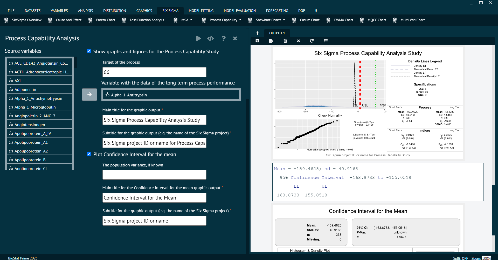

# Process Capability

Process Capability is a statistical measure that assesses how well a process can produce products or deliver services within specified limits. It is a key concept in statistical quality control and is used to determine whether a process is capable of meeting predefined specifications. The main objective of process capability analysis is to understand the inherent variability of a process and compare it to the tolerance or specification limits.

### Process Capability (Qcc Pkg)

To analyse in Process Capability (QccPkg) BioStat user must follow the steps given below.

Steps
: __Load the dataset -> Click on the Six Sigma tab in main menu -> Select Process Capability -> Choose Process Capability (Qcc Pkg) -> This leads to analysis techniques in the dialog -> selected the various options in the dialog according to the requirement -> Execute and visualise the output in output window.__

{ width="700" }{ border-effect="rounded" }

### Process Capability (SixSigma Pkg)

To analyse in Process Capability (SixSigma Pkg) BioStat user must follow the steps given below.

Steps
: ___Load the dataset -> Click on the Six Sigma tab in main menu -> Select Process Capability -> Choose Process Capability (SixSigma Pkg) -> This leads to analysis techniques in the dialog -> Selected the various options in the dialog according to the requirement -> Execute and visualise the output in output window.__

{ width="700" }{ border-effect="rounded" }

{ width="700" }{ border-effect="rounded" }
